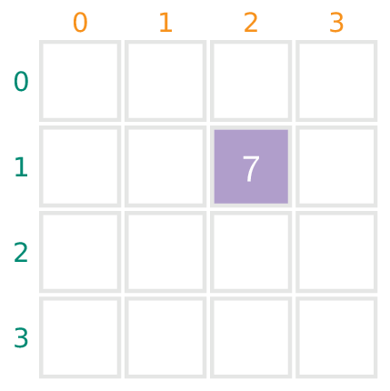
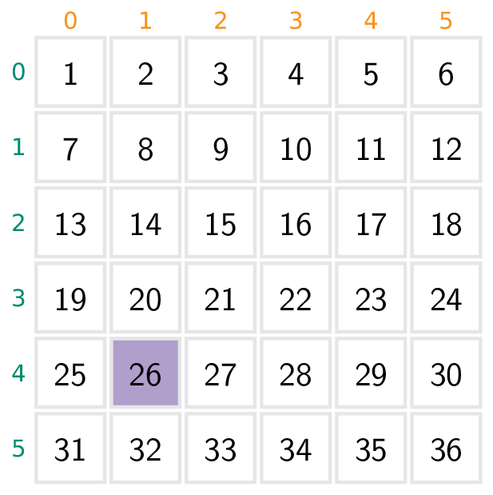
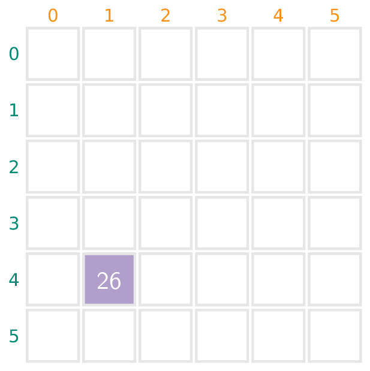

## Gegeven

Stel dat je een **vierkant** rooster krijgt dat rij per rij opgevulgd wordt met opeenvolgende natuurlijke getallen. 

In dat geval kan je voor elk getal dat in dit rooster staat de coördinaten opvragen. Zo staat het getal 7 in onderstaand 4 × 4 rooster op rij 1 en kolom 2. 

{:data-caption="Een 4 × 4 rooster." .light-only height="110px"}

{:data-caption="Een 4 × 4 rooster." .dark-only height="110px"}

## Gevraagd

Schrijf een programma dat aan de gebruiker eerst de zijde van het vierkant vraagt. Vervolgens vraag je naar het getal dat voorkomt binnen dit vierkant.

Druk tot slot het rij- en kolomnummer van dit getal af.

#### Voorbeelden

Voor een vierkant met zijde `4` en het getal `7` verschijnt:
```
Rijnummer: 1
Kolomnummer: 2
```

Voor een vierkant met zijde `6` en het getal `26` verschijnt:
```
Rijnummer: 4
Kolomnummer: 1
```

Want dit ziet er als volgt uit:

{:data-caption="Een 6 × 6 rooster." .light-only height="165px"}

{:data-caption="Een 6 × 6 rooster." .dark-only height="165px"}
