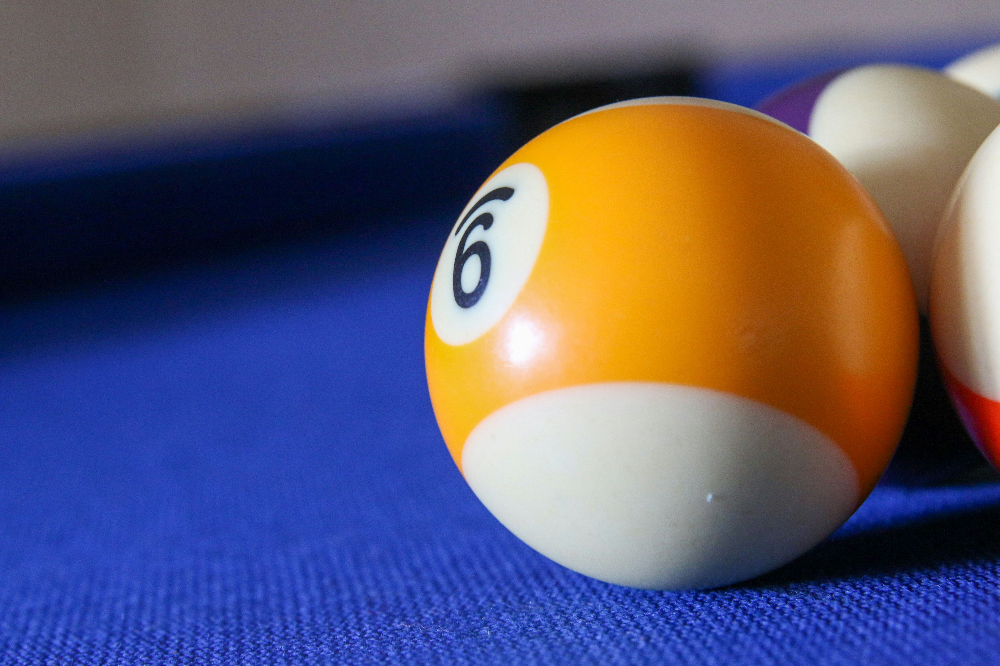

## Opgave
Schrijf een programma dat de straal van een <a href='https://nl.wikipedia.org/wiki/Bol_(lichaam)' target='_blanc'>bol</a> in cm vraagt en nadien zowel het volume als de oppervlakte van de bol berekent. Rond af op 2 cijfers na de komma.

{:data-caption="Een biljartbal." width="40%"}

#### Voorbeeld

Voor een bol met straal `4.0` cm verschijnt er.
```
oppervlakte: 201.06 cm²
volume: 268.08 cm³
```
