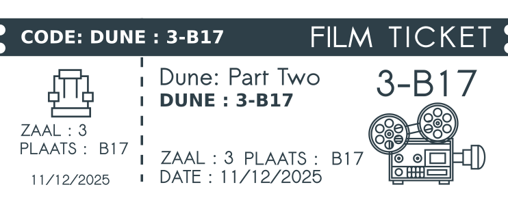

## Gegeven

Voor een filmavond worden cinematickets afgedrukt. Dit ticket bevat heel wat informatie zoals de titel van de film.

Verder vind je er ook een code met een afkorting van deze titel, het zaalnummer, de plaats van je gereserveerde zetel.

{:data-caption="Een cinematicket." width="25%"}

## Opgave
Schrijf een programma dat in volgorde aan de gebruiker vraagt naar de titel van de film, de afkorting, het zaalnummer en de zetelplaats.

Vervolgens construeer je de code die op het ticket moet verschijnen. Deze is van de vorm `afkorting : zaalnummer-zetelplaats`. Je geeft vervolgens alles netjes weer op het scherm.

#### Voorbeeld

Indien je naar de film `Dune: Part Two` met afkorting `DUNE` in zaal `3` op plaats `B17` gaat kijken, verschijnt er:
```
DUNE : 3-B17
Veel plezier met de film Dune: Part Two!
```