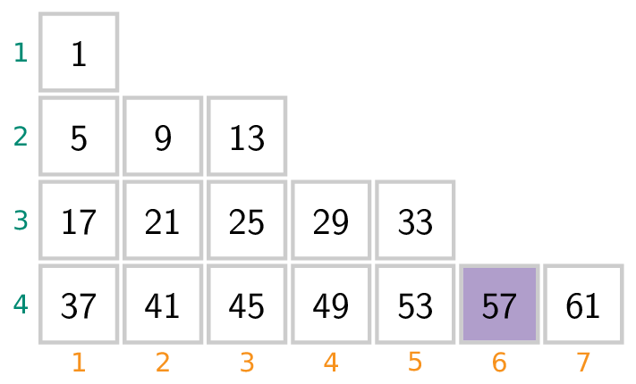
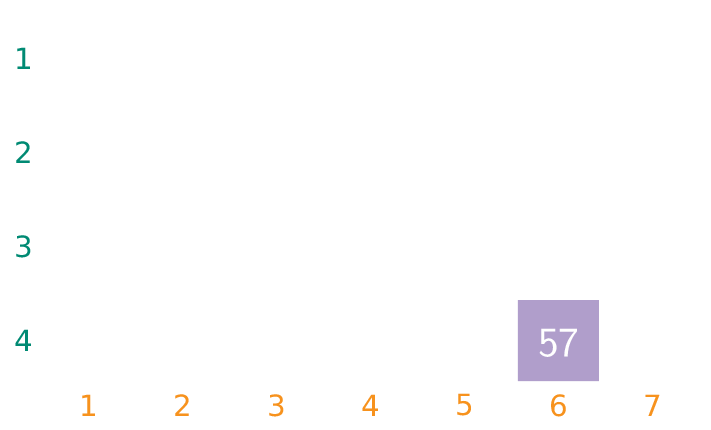

We bekijken de rij 1, 5, 9, 13,... van de viervouden plus 1. Je kan zelf nagaan dat ook 1997 deel uitmaakt van deze rij.

We plaatsen deze getallen nu in een soort schema en doen dit als volgt:

{:data-caption="Een schema met de viervouden plus 1." .light-only height="200px"}

{:data-caption="Een schema met de viervouden plus 1." .dark-only height="200px"}

We stellen vast dat het getal 57 in de vierde regel voorkomt en dit op de zesde plaats.

## Opgave

Schrijf een programma dat aan de gebruiker een getal vraagt (je mag ervan uitgaan dat de gebruiker steeds een viervoud + 1 intikt) en vervolgens bepaal je op welke regel en welke plaats dit getal in het schema staat.

#### Voorbeelden

Bij invoer `57` verschijnt er
```
57 staat op regel 4 plaats 6
```

Bij invoer `209` verschijnt er
```
209 staat op regel 8 plaats 4
```