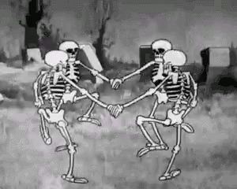

Eind oktober kan een nogal angstaanjagende tijd van het jaar zijn. De avond valt steeds vroeger, oude heidense rituelen wekken demonen tot leven en aan het eind van de maand zie je zelfs hordes kleine wezens door de straten zwerven! Griezeliger wordt het niet.

{:data-caption="Spooky." width="300px"}

Maar hoe griezelig is dit demonische feest eigenlijk? De mate van griezeligheid kan worden uitgedrukt als een natuurlijk getal S. Een simpel getal doet echter geen recht aan het griezelige gevoel. Daarom kan het ook worden omschreven met als het woord *spoo...oooky*, met evenveel keer de letter *o*.

## Opgave

Vraag aan de gebruiker het griezelgetal S en toon vervolgens het woord *spoo...oooky*, met evenveel keer de letter *o*.

#### Voorbeelden

Bij invoer 2 verschijnt:
```
spooky
```

Bij invoer 7 verschijnt:
```
spoooooooky
```

{: .callout.callout-info}
> #### Bron
> Woburn Challenge 2016-17