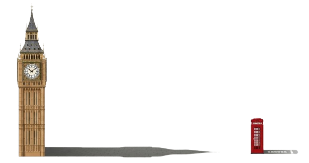

Met behulp van de schaduw en de hoogte van kleinere objecten kan je relatief eenvoudig de hoogte van een groter object schatten.

{:data-caption="De schaduw van Big Ben." width="40%"}

Stel dat je de hoogte van een telefooncel, de schaduw ervan en de schaduw van Big Ben (of een ander groot gebouw) meet, kan je dan de hoogte van het grote gebouw schatten?

## Opgave
Vraag (in volgorde) aan de gebruiker naar de hoogte van het kleinere object (de telefooncel), de lengte van de schaduw van het kleinere object en de lengte van de schaduw van het groter object.

Schat vervolgen de hoogte van het groter object. **Rond** hierbij **af** op twee decimalen.

#### Voorbeeld

Bij een telefooncel met hoogte `2.51` m met een schaduw van `1.74` m en `66.55` m als schaduw van Big Ben verschijnt er:
```
Het grote object is ongeveer 96.0 m hoog.
```
