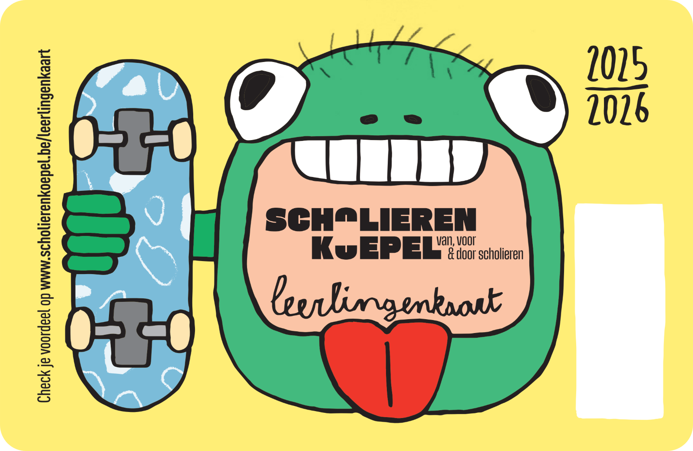

## Gegeven
In het begin van het schooljaar krijgt elke leerling uit het middelbaar een leerlingenkaart. Deze geeft recht op korting in meer dan 130 winkels, eetgelegenheden en zelfs pretparken!

{:data-caption="De leerlingenkaart van 2025-2026." width="40%"}

## Opgave

Schrijf een programma dat een identificatiecode van een leerling maakt. Hierbij vraag je in volgorde naar de voornaam van de leerling, het jaar, de klascode en het volgnummer van de leerling uit de klas.

Vervolgens genereer je een code van de vorm `jaar-klascode:volgnummer` en geef je dit weer zoals in onderstaande voorbeelden.

#### Voorbeelden

Voor de gebruiker `Louis` uit jaar `4` en klas `NAWE1` met volgnummer `15` verschijnt:
```
Louis, jij krijgt als ID: 4-NAWE1:15
```


Voor de gebruiker `Maram` uit jaar `4` en klas `LAB` met volgnummer `24` verschijnt:
```
Maram, jij krijgt als ID: 4-LAB:24
```
