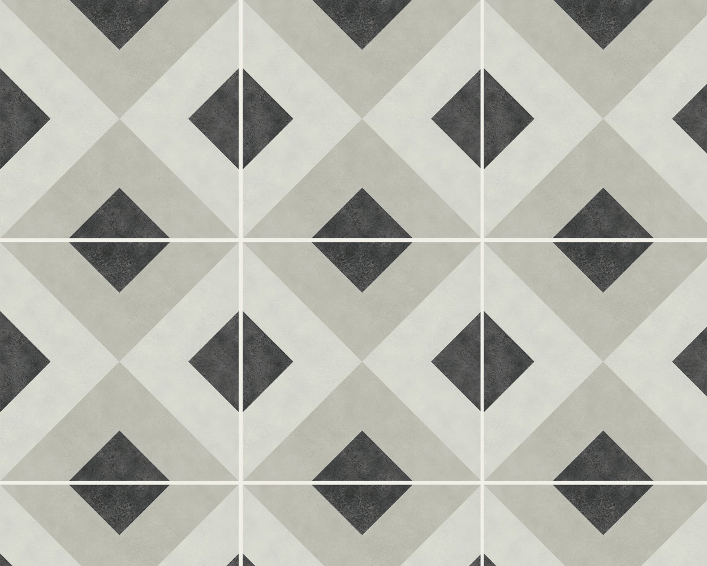

Een rechthoekige vloer moet betegeld worden met vierkante tegels, maar hoeveel tegels heeft men nodig?

{:data-caption="Vierkante tegels met een patroon." width="400px"}

## Opgave
Schrijf een programma dat in volgorde aan de gebruiker de lengte en breedte van de vloer (in meter!) vraagt. Vervolgens vraag je naar de zijde van de tegels (in centimeter!).

Bepaal daarna het aantal tegels dat minimaal nodig is om deze vloer te kunnen bedekken. Je mag de voegruimte tussen de tegels verwaarlozen in je berekeningen. Doordat de tegels van een patroon voorzien zijn, kan je eventuele overschotten van een tegel niet zomaar hergebruiken.

#### Voorbeelden

Indien je een vloer met lengte `3.2` m en breedte `2.2` meter wil vullen met tegels waarbij de zijde `60` cm meet, dan veschijnt:
```
Er zijn minimaal 24 tegels nodig.
```

De invoer `9995` levert als uitvoer
```
Je dient nog 5 stappen te zetten.
```