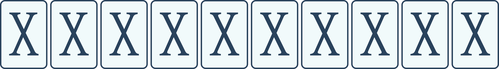
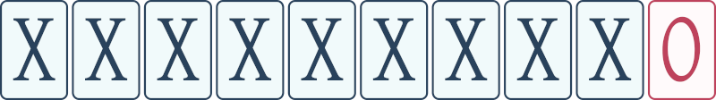
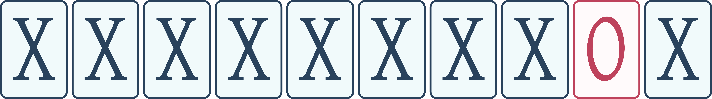
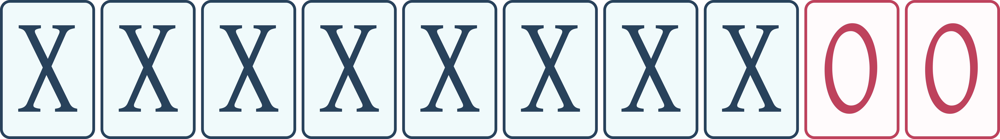

## Gegeven

Voor je op tafel liggen 10 kaarten netjes naast elkaar. Elke kaart heeft één blauwe (`X`) en één rode (`O`) kant en op dit moment liggen alle kaarten met de blauwe kant naar boven:

{:data-caption="Startsituatie." width="300px"}

Je gaat nu als volgt te werk: je draait van rechts naar links telkens de volgende kaart om en je stopt zodra je een blauwe kant hebt omgedraaid of zodra je alle 10 kaarten hebt omgedraaid. Dit noemen we één stap.

Na **één** stap blijven alle kaarten met de blauwe kant naar boven liggen, behalve de meest rechtse:

{:data-caption="Situatie na één stap." width="300px"}

Na **twee** stappen liggen alle kaarten met de blauwe kant naar boven, behalve de tweede van rechts:

{:data-caption="Situatie na twee stappen." width="300px"}

Na **drie** stappen liggen er 8 kaarten met de blauwe kant naar boven en de twee meest rechtse kaarten met de rode kant naar boven:

{:data-caption="Situatie na drie stappen." width="300px"}

## Gevraagd

Schrijf een programma dat aan de gebruiker het aantal stappen vraagt en vervolgens op het scherm de volgorde van de kaarten afdrukt.

#### Voorbeelden

Als de gebruiker `1` intikt, verschijnt er:
```
X X X X X X X X X O
```

Als de gebruiker `3` intikt, verschijnt er:
```
X X X X X X X X O O
```

Als de gebruiker `8` intikt, verschijnt er:
```
X X X X X X O X X X
```

Als de gebruiker `10` intikt, verschijnt er:
```
X X X X X X O X O X
```

{: .callout.callout-info}
> #### Bron
> IJkingstoets Informatica 2023/2024