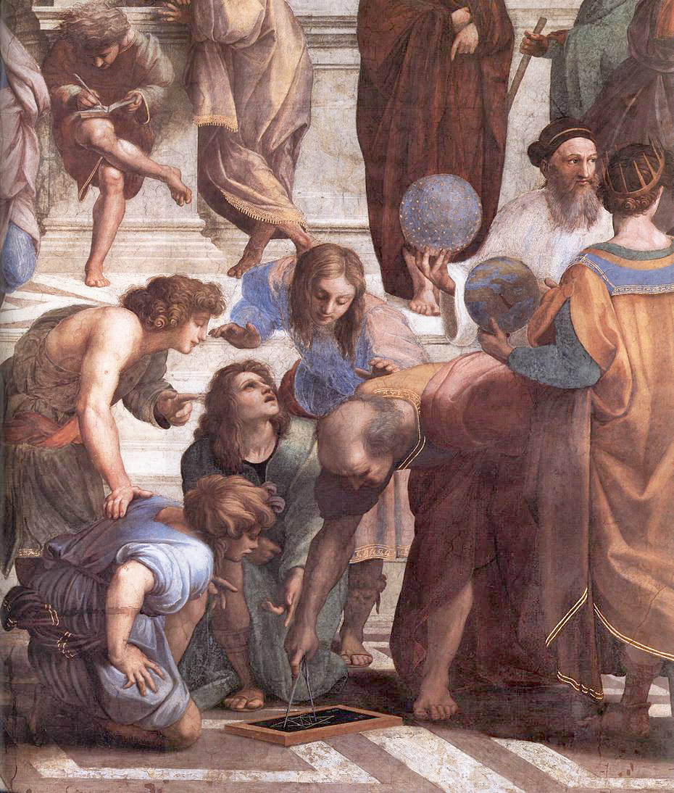

Het algoritme van **Euclides** is één van de oudste algoritmes ter wereld. Het algoritme dat beschreven werd in <a href='https://nl.wikipedia.org/wiki/Euclides_van_Alexandri%C3%AB' target='_blanc'>zijn</a> legendarische handboek <a href='https://nl.wikipedia.org/wiki/Elementen_(Euclides)' target='_blanc'>De Elementen</a> is een efficiënte manier om de **grootste gemene deler** (ggd) van twee getallen te bepalen.

{:data-caption="Euclides in de school van Athene door Rafaël." width="35%"}

Het algoritme werkt als volgt:

- Noem het grootste van de twee getallen a en het andere b
- Bepaal de rest bij deling van a door b
- is de rest nul, dan is b de ggd
- indien rest niet nul is, herhaal het algoritme dan voor b en de rest

## Opgave

Schrijf een programma dat twee gehele getallen aan de gebruiker vraagt en vervolgens de grootste gemene deler berekent met behulp van het algoritme van Euclides.

#### Voorbeelden

Indien de gebruiker `28` en `16` invoert, verschijnt er:
```
De grootste gemene deler van 28 en 16 is 4
```

Indien de gebruiker `16` en `28` invoert, verschijnt er:
```
De grootste gemene deler van 16 en 28 is 4
```

Indien de gebruiker `1140` en `900` invoert, verschijnt er:
```
De grootste gemene deler van 1140 en 900 is 60
```