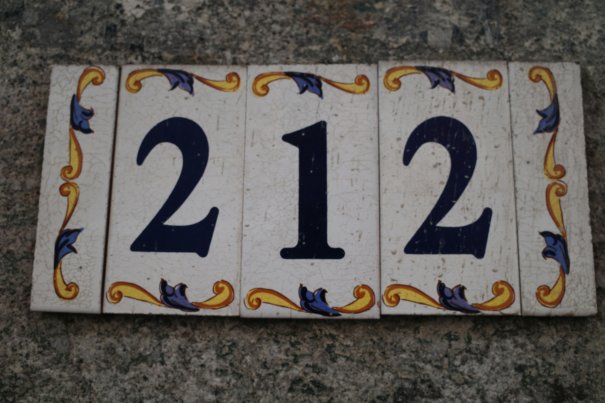

## Gegeven

Een isodigitaal getal is een getal waarbij een zeker cijfer minstens twee keer voorkomt. Zo zijn 447, 2 032, 77 777 voorbeelden van isodigitale getallen.

{:data-caption="Foto van Juan Gomez jr op Unsplash." width="40%"}

## Opgave

Schrijf een programma dat een bovengrens (kleiner dan 1000) aan de gebruiker vraagt en vervolgens alle **niet**-isodigitale getallen van drie cijfers **kleiner** dan de bovengrens op het scherm weergeeft. Geef deze getallen weer in stijgende volgorde.

Druk op het einde af hoeveel van deze getallen er afgedrukt werden.

#### Voorbeeld

Bij invoer `500` verschijnt er:
```
102 is niet-isodigitaal
103 is niet-isodigitaal
104 is niet-isodigitaal
...
498 is niet-isodigitaal
Er waren 288 niet-isodigitale getallen kleiner dan 500
```
