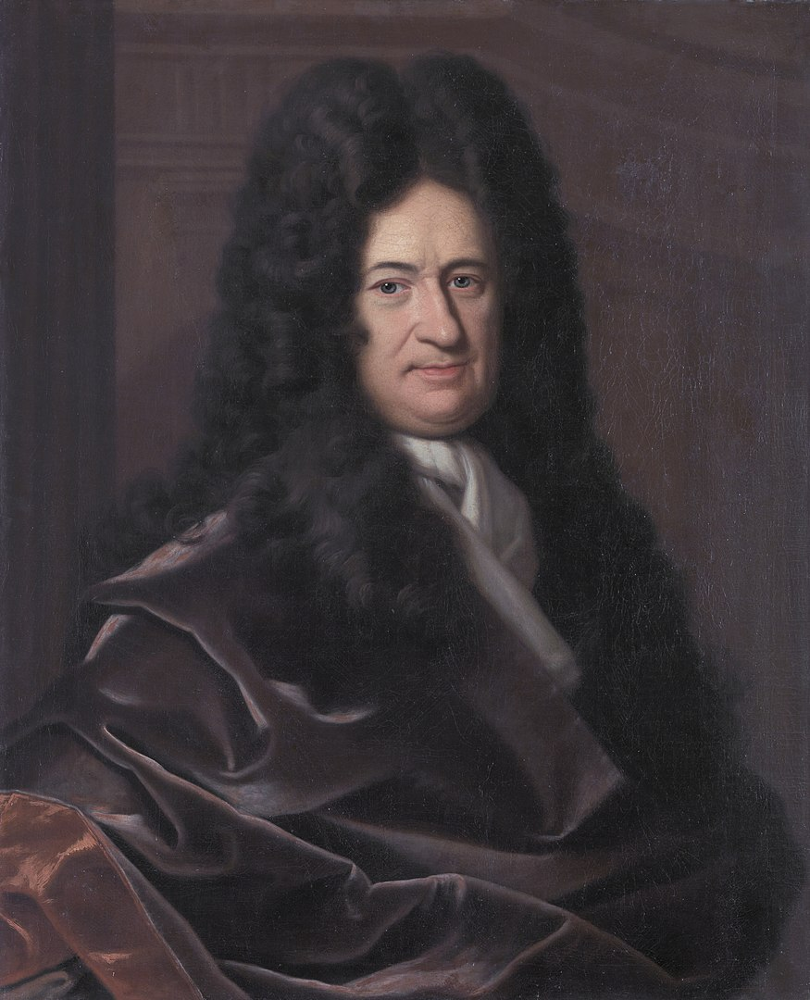

In 1673 bewees <a href='https://nl.wikipedia.org/wiki/Gottfried_Wilhelm_Leibniz' target='_blanc'>Gottfried Leibniz</a> onderstaande (alternerende) formule om het getal π te kunnen berekenen (in de praktijk: *benaderen*).

{:data-caption="Gottfried Wilhelm Leibniz, aartsrivaal van Sir Isaac Newton." width="20%"}

$$
\mathsf{\dfrac{\pi}{4} = 1 - \dfrac{1}{3}+\dfrac{1}{5} -\dfrac{1}{7}+\dfrac{1}{9}-\ldots}
$$

Door zowel het linker- als rechterlid te vermenigvuldigen met 4 vinden we een benadering voor π.

$$
\mathsf{\pi = 4 \cdot \left( 1 - \dfrac{1}{3}+\dfrac{1}{5} -\dfrac{1}{7}+\dfrac{1}{9}-\ldots \right)}
$$

## Opgave

Bepaal een benadering voor het getal π met bovenstaande uitdrukking. Vraag hierbij aan de gebruiker naar het aantal termen uit de som.
Rond de benadering steeds af op 9 cijfers na de komma.

#### Voorbeelden

Zoals je in onderstaande voorbeelden merkt moeten er vrij veel termen berekend opdat de benadering in de buurt komt.

Voor invoer `10` verschijnt:
```
De benadering met 10 temen bedraagt ongeveer 3.041839619
```

Voor invoer `100` verschijnt:
```
De benadering met 100 temen bedraagt ongeveer 3.131592904
```

Voor invoer `10000` verschijnt:
```
De benadering met 10000 temen bedraagt ongeveer 3.141492654
```

{: .callout.callout-info}
> #### Tip
> Het alterneren kan je gemakkelijk berekenen door een macht van `-1` uit te rekenen. Of door gebruik te maken van `%`.