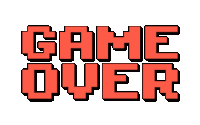

In veel computerspellen krijg je bij de start een aantal levens. Telkens je geraakt wordt, verlies je een leven, tot het scherm "Game Over" verschijnt...

{:data-caption="Helaas, Game Over!" width="180px"}

## Opgave

Schrijf een programma dat naar het aantal levens vraagt. Vervolgens tel je af tot "Game Over".

#### Voorbeeld

Als de gebruiker 5 intikt, verschijnt er:

```
Nog 5 levens
Nog 4 levens
Nog 3 levens
Nog 2 levens
Nog 1 leven
Game Over
```