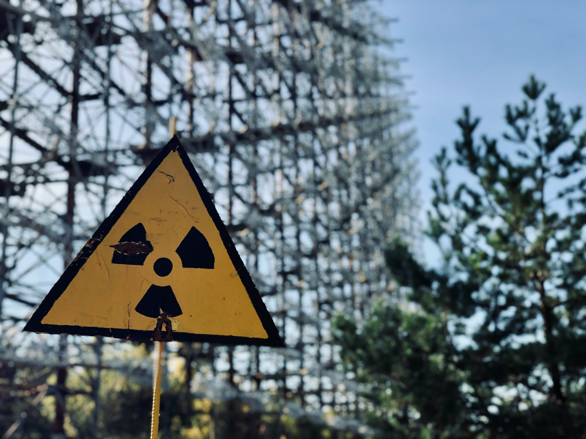

Na de kernramp van Tsjernobyl kwam onder andere Cesium-137 vrij in de omgeving terecht. Deze radioactieve stof blijft zeer lang aanwezig in bodem en gebouwen. Cesium-137 heeft een **halveringstijd** van ongeveer **30 jaar**. Dat betekent dat na elke periode van 30 jaar nog slechts de helft van de oorspronkelijke massa overblijft.

{:data-caption="Foto door Vladyslav Cherkasenko op Unsplash." width="40%"}

Een zone wordt veilig verklaard wanneer de resterende massa Cesium-137 onder 1 kg zakt.

## Opgave

Schrijf een programma dat naar een hoeveelheid radioactief Cesium-137 binnen een zone vraagt (in kilogram). 
Zoek vervolgens na hoeveel jaar de hoeveelheid radioactieve stof **minder** dan 1 kg bedraagt.

Na elke periode geef je de resterende hoeveelheid weer. Rond deze massa af op 1 decimaal.

#### Voorbeelden

Bij een invoer van `120.0` kg, verschijnt:
```
Na 30 resteert nog 60.0 kg.
Na 60 resteert nog 30.0 kg.
Na 90 resteert nog 15.0 kg.
Na 120 resteert nog 7.5 kg.
Na 150 resteert nog 3.8 kg.
Na 180 resteert nog 1.9 kg.
Na 210 resteert nog 0.9 kg.
Na 210 jaar kan deze zone veilig verklaard worden.
```

Bij een invoer van `23.5` kg, verschijnt:
```
Na 30 resteert nog 11.8 kg.
Na 60 resteert nog 5.9 kg.
Na 90 resteert nog 2.9 kg.
Na 120 resteert nog 1.5 kg.
Na 150 resteert nog 0.7 kg.
Na 150 jaar kan deze zone veilig verklaard worden.
```