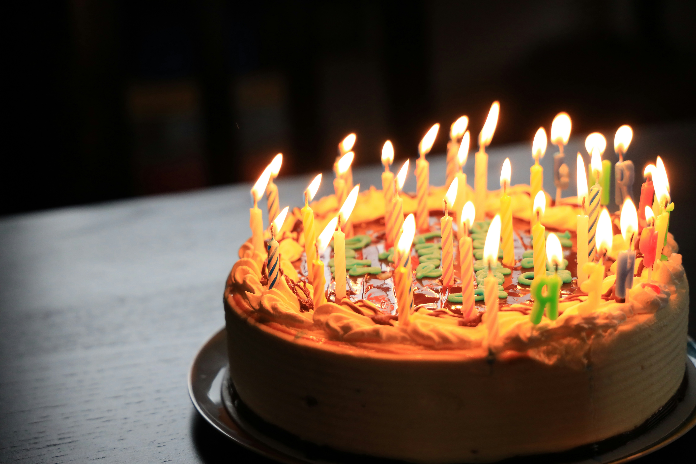

Mijn broer merkte onlangs op dat zijn leeftijd, 59, en die van mijn moeder, 95, als het ware omgekeerd waren.

*Ja zei mijn moeder, maar 33 jaar geleden was dat ook het geval.*

Inderdaad! Dan was mijn broer 26 jaar en mijn moeder 62 jaar.

{:data-caption="Foto door Richard Burlton op Unsplash." width="40%"}

Is dit toeval? Of komt dit vaker voor?

## Opgave
Schrijf een programma dat (in volgorde) de leeftijd van de zoon en de moeder vraagt. Vervolgens druk je alle momenten af waarbij ze jonger waren en de leeftijden elkaars *omgekeerde* zijn. De leeftijd van de zoon is uiteraard steeds kleiner dan deze van de moeder.

Beschouw hierbij enkel leeftijden die uit **exact twee cijfers** bestaan.

#### Voorbeelden

Indien de zoon `59` jaar is en de moeder `95` jaar, dan verschijnt er:

```
Dit jaar is de zoon 59 en de moeder 95 jaar.
11 jaar geleden was de zoon 48 jaar en de moeder 84 jaar.
22 jaar geleden was de zoon 37 jaar en de moeder 73 jaar.
33 jaar geleden was de zoon 26 jaar en de moeder 62 jaar.
44 jaar geleden was de zoon 15 jaar en de moeder 51 jaar.
```

Indien de zoon `38` jaar is en de moeder `65` jaar, dan verschijnt er:

```
2 jaar geleden was de zoon 36 jaar en de moeder 63 jaar.
13 jaar geleden was de zoon 25 jaar en de moeder 52 jaar.
24 jaar geleden was de zoon 14 jaar en de moeder 41 jaar.
```

Indien de zoon `46` jaar is en de moeder `65` jaar, dan verschijnt er:

```
De leeftijden waren nooit elkaars omgekeerde.
```


