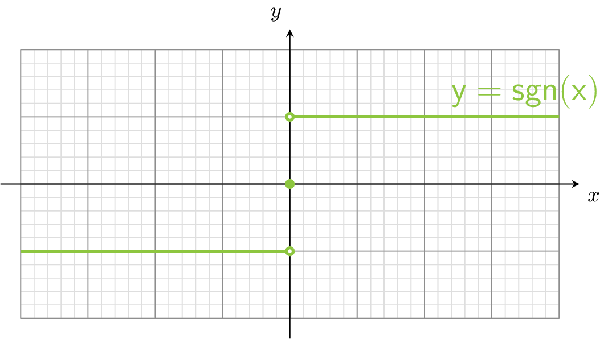
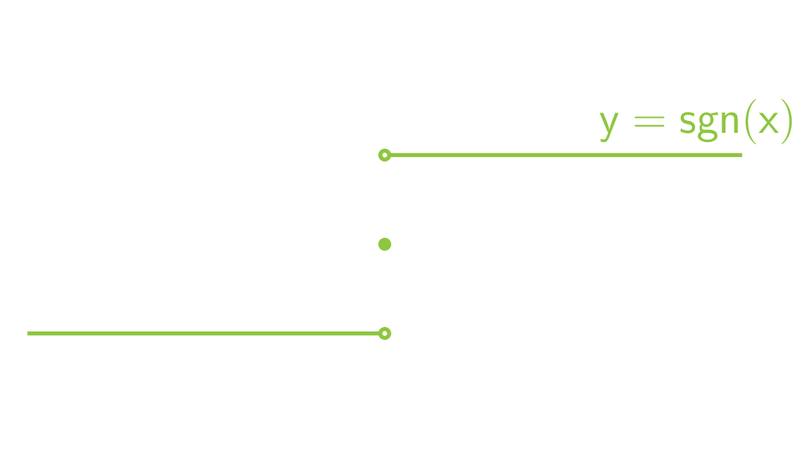

Programmeer de <a href='https://nl.wikipedia.org/wiki/Signum_(wiskunde)' target='_blanc'>signum</a>-functie:

$$\mathsf{
\text{sgn}: x \mapsto \begin{cases}
-1 & \text{\textsf{als} } x < 0\\
0 & \text{\textsf{als} } x = 0\\
1 & \text{\textsf{als} } x > 0
\end{cases}}
$$

De signum functie heeft onderstaande grafiek:

{:data-caption="De grafiek van de signum functie." .light-only height="355px"}

{:data-caption="De grafiek van de signum functie." .dark-only height="355px"}

## Opgave
Schrijf een functie `sgn()` die de waarden -1, 0 en 1 geeft zoals gevraagd.

#### Voorbeelden

```python
>>> sgn(10)
1
```

```python
>>> sgn(0)
0
```

```python
>>> sgn(-3.1415)
-1
```