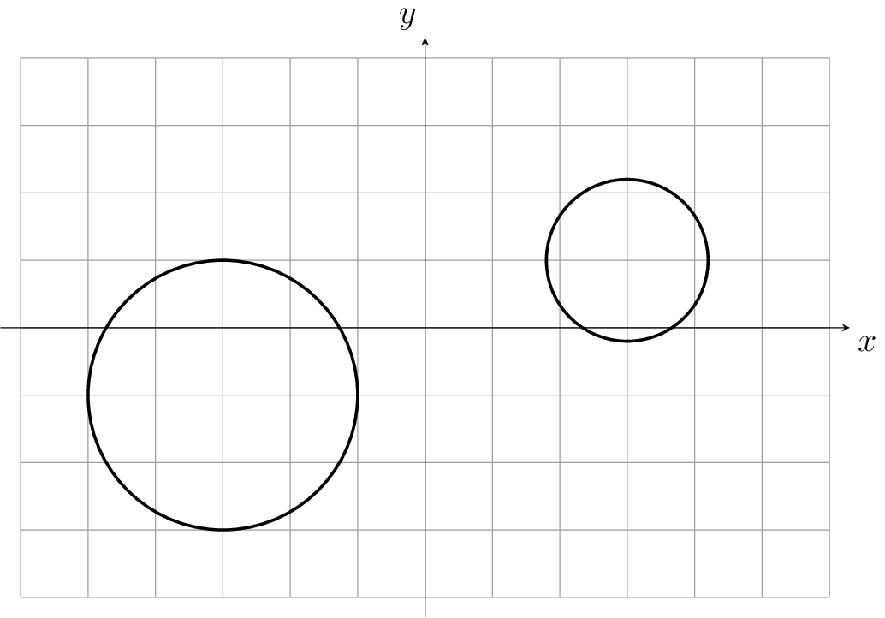

## Gegeven

Als je twee cirkels in het vlak tekent, dan kunnen die op verschillende manieren liggen ten opzichte van elkaar. Dit zijn de **zeven mogelijkheden**:

- samenvallend
- concentrisch
- snijdend (er zijn twee snijpunten)
- inwendig rakend (de ene cirkel ligt binnen de andere en ze hebben één punt gemeenschappelijk)
- uitwendig rakend (er is één punt gemeenschappelijk en ze liggen niet in elkaar)
- inwendig disjunct (de ene cirkel ligt binnen de andere en er is niets gemeenschappelijk)
- uitwendig disjunct (de cirkels hebben niets gemeenschappelijk)

Je ziet alle mogelijkheden in de animatie hieronder.

{:data-caption="Onderlinge ligging van 2 cirkels." .light-only height="350px"}

{:data-caption="Onderlinge ligging van 2 cirkels." .dark-only height="350px"}

## Opgave

Schrijf een functie `onderlinge_ligging(x1, y1, r1, x2, y2, r2)` die gegeven de coördinaten van het middelpunt en de stralen van beide cirkels de onderlinge ligging van deze cirkels bepaalt.

Maak hiervoor gebruik van een functie `afstand(x1, y1, x2, y2)` die de (Euclidische) afstand tussen de punten `(x1,y1)` en `(x2,y2)` retourneert.


#### Voorbeelden

```python
>>> onderlinge_ligging(0, 0, 5, 0, 0, 2)
"concentrisch"
```
```python
>>> onderlinge_ligging(4, 3, 2, -1, 3, 3)
"uitwendig rakend"
```