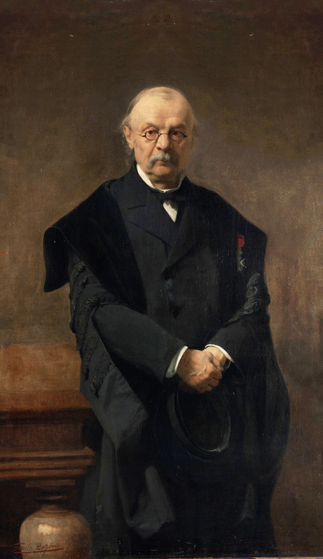

In de combinatoriek vormen de Catalan-getallen een rij van natuurlijke getallen die voorkomen in diverse telproblemen. Ze zijn naar de Belgische wiskundige <a href="https://nl.wikipedia.org/wiki/Eug%C3%A8ne_Charles_Catalan" target="_blank">Eugène Catalan</a> genoemd.

{:data-caption="Eugène Catalan geschilderd door Émile Delperée." width="25%"}

Deze getallen worden recursief gedefinieerd als:

$$
    \mathsf{C_{n+1} = \dfrac{2\cdot(2n+1)}{n+2} \cdot C_{n} \qquad\text{\textsf{met}}\qquad C_0 = 1}
$$

Wat resulteert in deze rij:

$$
    \mathsf{1,\qquad 1,\qquad 2,\qquad 5,\qquad 14,\qquad 42,\qquad 132,\qquad 429,\qquad  \ldots}
$$

## Opgave

Schrijf een **recursieve** functie `catalan(n)` die voor een natuurlijk getal n, het Catalan-getal met rangnummer n teruggeeft.

#### Voorbeelden

```python
>>> catalan(1)
1
```

```python
>>> catalan(6)
132
```