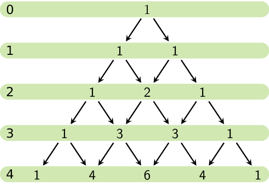
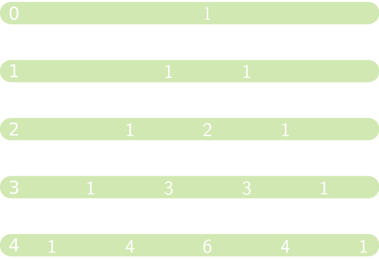

De <a href="https://nl.wikipedia.org/wiki/Driehoek_van_Pascal" target="_blank">driehoek van Pascal</a> is een rangschikking van de binomiaalcoëfficiënten.

Meestal wordt deze rangschikking in deze driehoekige structuur getekend:

{:data-caption=De driehoek van Pascal." .light-only width="35%"}

{:data-caption=De driehoek van Pascal." .dark-only width="35%"}

Je kan de getallen uit deze driehoek aanduiden aan de hand van hun rij- en kolomnummer. In het voorbeeld zie je de rijnummers toenemen van 0 tot en met 4. De kolomnummers bepaal je door te tellen van links naar rechts (door te tellen vanaf 0).

Zo is het element op rij 4 en kolom 2 gelijk aan 6, het element op rij 4 en kolom 4 is 1, enz...

## Opgave

Schrijf een **recursieve** functie `pascal(rij, kolom)` die het element die specifieke plaats in de driehoek van Pascal teruggeeft.

#### Voorbeelden

```python
>>> pascal(4, 2)
6
```

```python
>>> pascal(4, 4)
1
```

```python
>>> pascal(0, 0)
1
```