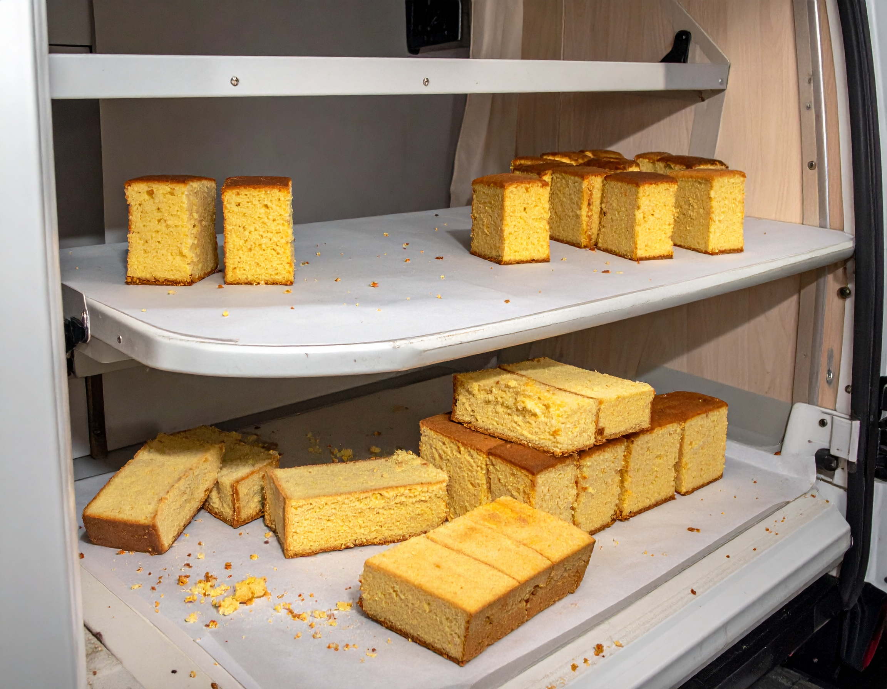

## Gegeven

Een rechthoekige cake wordt met een truck naar een restaurant getransporteerd. Op weg naar de bestemming wordt de cake echter helemaal door elkaar geschud en valt deze in perfect rechthoekige stukken met een bepaalde lengte en breedte.

{:data-caption="Rechthoekige stukken cake." width="35%"}

Gelukkig zijn alle aparte stukken nog volledig intact. Aangekomen op de bestemming beslist men een vervangende cake met dezelfde afmetingen te bestellen. Op het originele bestelformulier is echter enkel de breedte van de cake ingevuld. Het restaurant vraagt je hulp om de lengte te bepalen.

## Opgave

Schrijf een functie `lengte_cake(breedte, stukken)` die voor de gekende `breedte` en een **lijst** met de afmetingen van alle `stukken` de oorspronkelijke lengte bepaalt.

#### Voorbeeld

Indien men van de oorspronkelijke cake die breedete 4 had nog zeven stukken terugvindt, met onderstaande afmetingen, dan geldt:

```
>>> lengte_cake(4, [[2,3], [1, 4], [1, 2], [1, 2], [2, 2], [2, 2], [2, 1]])
6
```

{: .callout.callout-info}
> #### Bron
> Southwestern Europe Regional Contest (SWERC), 2017