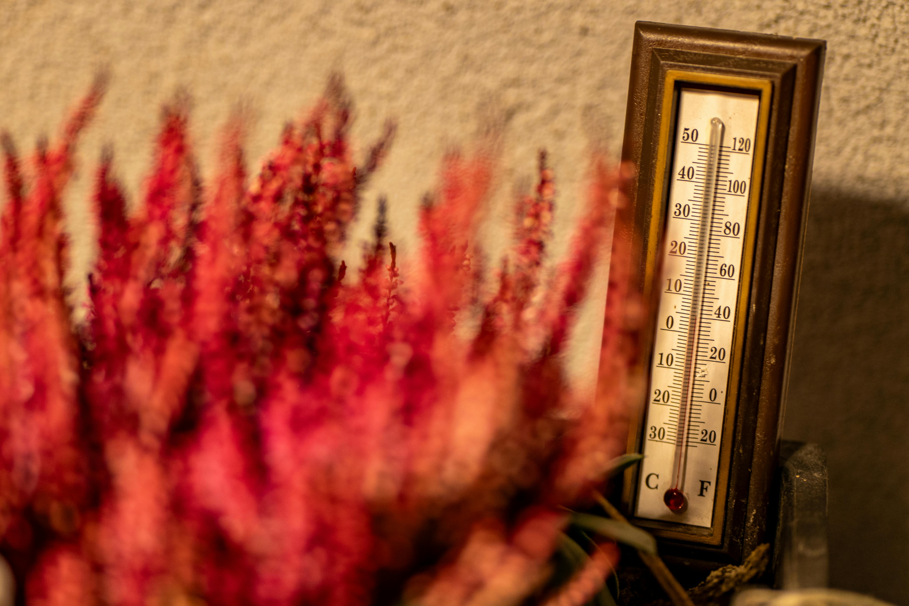

Hoe warm of hoe koud wordt het de komende uren?

{:data-caption="Foto door Vladimir Srajber op Pexels." width="40%"}

De meeste weermodellen slagen er goed in om de temperaturen in de nabije toekomst nauwkeurig te voorspellen. Via onderstaande code wordt een lijst opgehaald met alle temperatuurvoorspellingen binnen Aalst in de komende uren.

Zo zal de variabele `temperaturen` een lijst bevatten van de vorm: `[16.1, 17.2, 15.1, 14.2, 15.0, ..., 20.2]`. Dit stellen de uurlijkse temperaturen voor sinds middernacht.

## Gevraagd
Vraag een **doeltemperatuur** aan de gebruiker en onderzoek met behulp van de laatste gegevens hoeveel uur het nog duurt tot deze temperatuur bereikt wordt. (Te rekenen vanaf middernacht)

#### Voorbeelden
Bij een invoer van `15.0` kan er verschijnen:

```
De temperatuur 15.0 °C wordt bereikt na 16 uren.
```

Bij een invoer van `34.0` kan er verschijnen:

```
De temperatuur 34.0 °C wordt in de nabije toekomst niet bereikt.
```