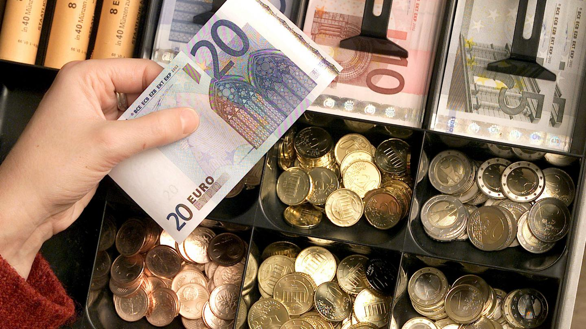

## Opgave
Lees een bedrag in (als een geheel getal) en bepaal met behulp van de computer het **minimale** aantal briefjes van 50, 20, 10 en 5 euro en het aantal stukken van 2 en 1 euro zodat deze samen het bedrag vormen.

#### Voorbeeld
Voor een bedrag van € 227 krijg je:
```
biljet 50: 4
biljet 20: 1
biljet 10: 0
biljet 5: 1
munt 2: 1
munt 1: 0
```

{: .callout.callout-info}
> #### Tip
> Gebruik voor deze oefening de volgende bewerkingen de **gehele deling** `//` en **modulo** `%`. Controleer eerst wat `10 // 7` en `10 // 3` oplevert.


{:data-caption="Kassa met verschillende eurobiljetten" width="35%"}

