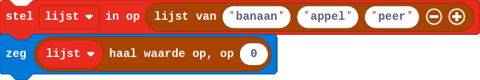

## Lijsten
Een lijst is een datatype dat meerdere elementen kan bevatten van een ander datatype. Lijsten worden gedefinieerd met vierkante haakjes `[  ]` en kommas tussen de elementen.

```python
lijst = [ 'banaan', 'appel', 'peer' ]
```
Hier zie je een lijst met drie elementen, telkens van het datatype `string`. Je kan gemakkelijk de elementen van deze lijst apart bewerken, dat doe je met behulp van de rangnummers. In Minecraft zou je als volgt werken:

{:data-caption="Een lijst gebruiken in Minecraft Education Edition" width="600px"}

```python
lijst = [ 'banaan', 'appel', 'peer' ]
print( lijst[0] )
print( lijst[1] )
print( lijst[2] )
```

{: .callout.callout-danger}
> #### Opgelet
> Merk op dat het **eerste** element van de lijst rangnummer `0` heeft!

### Methodes
Met behulp van `.append()` kan je nieuwe items aan een lijst toevoegen.
```python
lijst = [ 'banaan', 'appel', 'peer' ]
lijst.append( 'mango' )
print( lijst )
```

Met behulp van `.extend()` kan je verschillende lijsten samenvoegen.
```python
lijst = [ 'banaan', 'appel', 'peer' ]
lijst_exotisch = [ 'mango', 'ananas' ]
lijst.extend( lijst_exotisch )
print( lijst )
```

Met behulp van `.sort()` kan je een lijst sorteren. Lijsten met tekst worden alfabetisch gesorteerd, numerieke lijsten worden van laag naar hoog gesorteerd.
Door `reverse = True` toe te voegen als argument wordt de volgorde omgedraaid.
```python
lijst = [ 'banaan', 'appel', 'peer' ]
lijst.sort()
print( lijst )
lijst.sort( reverse = True )
print( lijst )
```

## Opgave
Indien je 5 boeken bestelt van € 20,34 en hier € 15,3 verzendingskosten voor betaald, bereken dan de uiteindelijke kostprijs.

Vul het onderstaande programma aan. Zorg ervoor dat de kostprijs uiteindelijk weergegeven wordt. Welk datatype heeft `kostprijs`?