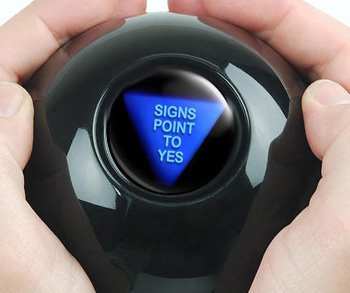

## Opgave
Een magische bol (in Amerika is dit de *magic 8-ball*) geeft een willekeurig antwoord op een vraag. De lijst hieronder bevat de mogelijke antwoorden.
Maak een magische-bol programma dat een toevalsantwoord geeft op iedere willekeurige vraag.

{:data-caption="Een magic 8-ball." width="35%"}

#### Voorbeelden
Op de vraag *Win ik morgen de Lotto?* kan de magic 8-ball antwoorden *Zonder twijfel*.