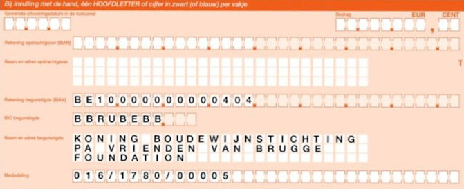

## Opgave
Vaak wordt aan een overschrijving een gestructureerde medeling (ogm) toegevoegd. Met behulp van deze medeling kan de ontvangende partij gemakkelijk controleren of het correcte bedrag werd overgeschreven. De mededeling vind je onderaan een overschrijvingsformulier:

{:data-caption="Een overschrijvingsformulier met onderaan de gestructureerde mededeling" width="45%"}

Deze bestaat steeds uit drie getallen van achtereenvolgens 3, 4 en 5 cijfers.

$$
016/1780/000\,\,\mathbf{05}
$$

Er is een mechanisme in deze mededeling ingebouwd, zodat je beschermd bent tegen tikfoutjes. De laatste 2 cijfers zijn immers steeds de rest bij deling van alle voorgaande getallen door 97. In het bovenstaande geval zal je merken dat 016 1780 000 rest 5 heeft bij een deling door 97.

{: .callout.callout-info}
> #### Tip
> In Python kan je de rest eenvoudig berekenen met behulp van de **modulo**-operator `%`. Controleer bijvoorbeeld even `10 % 7`, `10 % 3` en `161 780 000 % 97`.

Maak nu een programma dat achtereenvolgens een getal van 3, 4 en tot slot opnieuw 3 cijfers vraagt en met behulp van deze cijfers het controlegetal berekent zodat er een geldige ogm bekomen wordt.

#### Voorbeeld
Voor het bovenstaande voorbeeld zouden de getallen `016`, `1780` en `000` dus leiden tot:
```
controlegetal: 5
```

{: .callout.callout-warning}
> #### Opmerking
> Indien de deling geen rest heeft, dan wordt 97 gebruikt als controlegetal (in plaats van 00). Daar hoef je in deze oefening geen rekening mee te houden.

