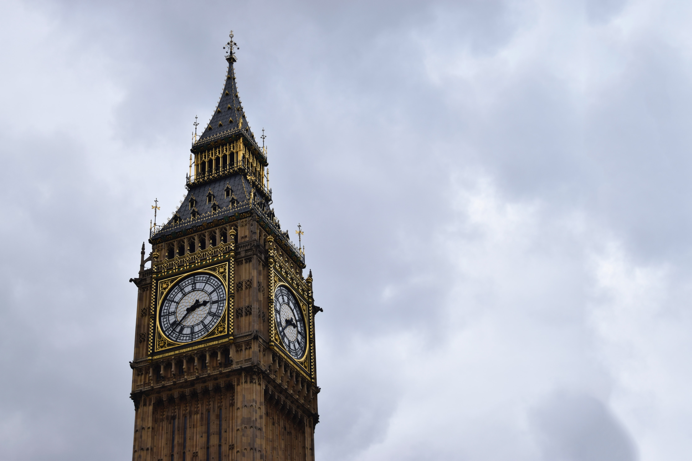

## Opgave

Schrijf een programma dat aan een gebruik een aantal uur $$U$$, minuten $$M$$ en seconden $$S$$ sinds middernacht vraagt (met $$0 \leqslant H \leqslant 12, 0 \leqslant M \leqslant 60$$ en $$0\leqslant S \leqslant 60$$).

Vervolgens berekent het programma de hoek (in **graden**) die de uurwijzer op de klok aangeeft. Rond het resultaat af op 5 cijfers na de komma.

{:data-caption="De wereldberoemde klok: 'Big Ben'" width="40%"}

#### Voorbeeld
Na exact 3 uur maakt de uurwijzer een hoek van 90°
```
90.0 graden
```

Na 1 uur en 2 minuten en 6 seconden maakt de uurwijzer een hoek van 31.05 graden.
```
31.05 graden
```