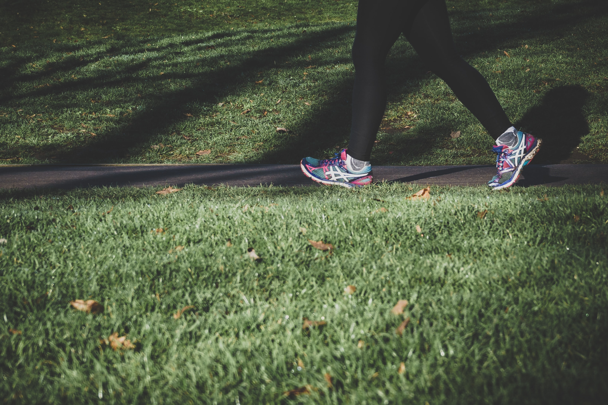

Volgens <a href="https://www.vrt.be/vrtnws/nl/2022/03/10/zo-bespaar-je-met-je-gezin-autobrandstof-in-dure-tijden/" target="_blank">dit artikel</a> van VRT.NWS verbruikt een moderne dieselwagen zo'n 4,5 liter diesel per 100 km.

{:data-caption="Foto door Arek Adeoye op Unsplash" width="60%"}

## Opgave
Schrijf een programma dat het aantal stappen vraagt

#### Voorbeeld
De invoer `100.0` levert als uitvoer
```
4.5 liter
```

De invoer `45.0` levert als uitvoer
```
2.02 liter
```