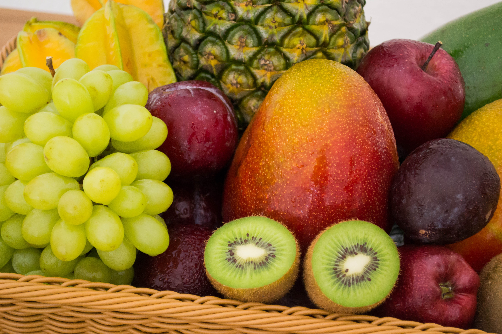

Fruit eten is gezond, dat weet iedereen. Maar naast gezonde vezels, antioxidanten, enz. bevatten bepaalde fruitsoorten vrij veel suiker.

{:data-caption="Een gezonde hoeveelheid fruit." width="45%"}

## Opgave
100 g watermeloen bevat bijvoorbeeld 6 g suiker. Hieronder staat een programma dat de gebruiker vraagt hoeveel gram fruit hij/zij zal consumeren en vervolgens op het scherm de hoeveelheid suikers afdrukt.

```python
# Vraagt de gebruiker naar invoer.
hoeveelheid = int( input( 'Geef het aantal gram fruit je zal eten:' ) )

# Voert de berekeningen uit.
suikers_watermeloen = round( hoeveelheid * 6 / 100, 2 )

# Verzorgt de afdruk op het scherm.
print( hoeveelheid, 'g watermeloen bevat', suikers_watermeloen, 'g suiker.')
```

Pas het programma nu aan zodat ook de hoeveelheid suikers voor de volgende soorten fruit op het scherm afgedrukt worden.

| Fruit | Hoeveelheid suikers per 100 g |
|:--------:|:-------------:|
| Watermeloen  | 6 g |
| Banaan | 12 g |
| Appel | 10 g |
| Kiwi | 9 g |
| Druif | 16 g |
{:class="table table-striped table-condensed" style="width:auto;margin-left:auto;margin-right:auto;"}

#### Voorbeelden
De invoer `25` levert als uitvoer
```
25 g watermeloen bevat 1.5 g suiker.
25 g banaan bevat 3.0 g suiker.
25 g appel bevat 2.5 g suiker.
25 g kiwi bevat 2.25 g suiker.
25 g druiven bevat 4.0 g suiker.
```

De invoer `85` levert als uitvoer
```
85 g watermeloen bevat 5.1 g suiker.
85 g banaan bevat 10.2 g suiker.
85 g appel bevat 8.5 g suiker.
85 g kiwi bevat 7.65 g suiker.
85 g druiven bevat 13.6 g suiker.
```