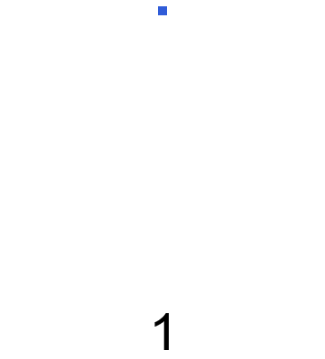

Een vijfhoeksgetal is een getal, dat het aantal punten is van gezamenlijke regelmatige vijfhoeken met een gemeenschappelijk eerste hoekpunt en twee gedeeltelijk gemeenschappelijke zijden, en met een telkens oplopend aantal punten per zijde. 

De rij van vijfhoeksgetallen begint als volgt:
$$
    1,\qquad 5,\qquad 12,\qquad 22,\qquad 35,\qquad 51, \ldots
$$

{:data-caption="De eerste zes vijfhoeksgetallen." width="40%"}

Het $$n$$<span style="vertical-align: super">de</span> $$V_n$$ kan men berekenen met de volgende formule:

$$
V_n = \dfrac{n\cdot(3n-1)}{2}
$$

## Opgave
Schrijf een programma dat aan de gebruiker vraagt welk vijfhoeksgetal er berekent moet worden. Vervolgens geeft het programma dat vijfhoeksgetal.

#### Voorbeelden
Voor invoer `2` verschijnt:
```
Het 2.0 de vijfhoeksgetal is 5
```

Voor invoer `15` verschijnt:
```
Het 15.0 de vijfhoeksgetal is 330
```

{: .callout.callout-info}
> #### Tip
> Om een kommagetal om te vormen naar een geheel getal gebruik je `int()`. Zo is `int( 330.0 ) = 330`.