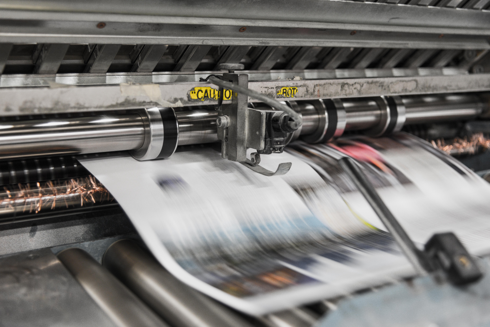

De pixeldichtheid is een belangrijke grootheid voor de kwaliteit van een afbeelding. Pixeldichtheid wordt uitgedrukt in pixels per inch, of **ppi**. Wil je een kwaliteitsvolle afdruk, dan moet de afbeelding een pixeldichtheid van minimaal 300 ppi hebben.

{:data-caption="Het realiseren van een industrieële afdruk." width="40%"}

Stel bijvoorbeeld dat je een afbeelding hebt van 1754 x 2480 pixels met een pixeldichtheid van 300 ppi. Dan kan je eenvoudig berekenen op welke grootte je deze afbeelding kan afdrukken zonder kwaliteitsverlies. Door zowel de breedte als hoogte te delen door de pixeldichtheid krijg je een afbeelding van 5,8467 inch x 8,2667 inch. Gezien één inch overeenkomt met 2,54 cm is het vervolgens eenvoudig om dit om te rekenen en men bekomt een afbeelding van 14,851 op 20,997 cm.

## Opgave
Schrijf een programma dat de breedte en hoogte van een afbeelding in pixels vraagt. Vervolgens vraagt dit programma de pixeldichtheid.
Het programma berekent tot slot de maximale lengte en breedte van de bijbehorende afdruk zonder kwaliteitsverlies. Rond op het einde af op 3 cijfers.

#### Voorbeeld
Bij achtereenvolgende invoer van `1754`, `2480` en pixeldichtheid `300` verschijnt er:
```
Deze foto kan je afdrukken op 14.851 x 20.997 cm.
```