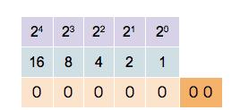

Het binaire talstelsel vormt de basis van elk hedendaags computersysteem. Het is net als het decimale talstelsel een positiestelsel. Elke plaats komt overeen met een macht van 2. Het binaire getal wordt enkel opgebouwd uit 0 en 1.

Er geldt bijvoorbeeld dat het binaire getal 01001 gelijk is aan het decimale getal 9, want

$$
0\mathbf{1}00\mathbf{1} = 0\cdot 2^4 + \mathbf{1}\cdot 2^3 + 0 \cdot 2^2 + 0 \cdot 2^1 + \mathbf{1} \cdot 2^0 = 9
$$

Hier zie je hoe men tot 31 kan tellen met behulp van 5 bits (5 posities voor 0 en 1).

{:data-caption="Tellen tot 31 met 5 bits." width="268px"}

## Opgave
Schrijf een programma dat een binair getal van 5 bits vraagt en vervolgens het decimale equivalent op het scherm afdrukt.

#### Voorbeelden
Voor de invoer `01001` verschijnt er:
```
Dit is 9 in het decimale talstelsel
```

Voor de invoer `11111` verschijnt er:
```
Dit is 31 in het decimale talstelsel
```