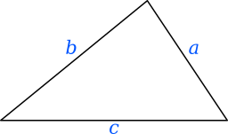

Een vijfhoeksgetal is een getal, dat het aantal punten is van **gezamenlijke** regelmatige vijfhoeken met een gemeenschappelijk eerste hoekpunt en twee gedeeltelijk gemeenschappelijke zijden, en met een telkens oplopend aantal punten per zijde. 

De formule van Heron is een bijzondere formule waarmee de oppervlakte van een driehoek berekend kan worden aan de hand van de zijden. De formule is genoemd naar <a href="https://nl.wikipedia.org/wiki/Heron_van_Alexandri%C3%AB" target="_blank">Heron van Alexandrië</a> die deze bewezen heeft in zijn grote werk *Metrica*.

De formule voor een driehoek met zijden $$a$$, $$b$$ en $$c$$ is als volgt:

$$
    A = \sqrt{s \cdot (s-a)\cdot (s-b)\cdot (s-c) }
$$

hierbij stelt $$s$$ de halve omtrek voor.

{:data-caption="Een driehoek met zijden a, b en c." width="30%"}

## Opgave
Schrijf een functie `oppervlakte( a, b, c )` die de oppervlakte van een willekeurige driehoek berekent met behulp van de formule van Heron. Rond het resultaat af op 2 cijfers na de komma.

#### Voorbeelden

```
>>> oppervlakte(4,13,15) # doctest: +STDOUT
24.0

```

```
>>> oppervlakte(15,18,20) 
129.76
```