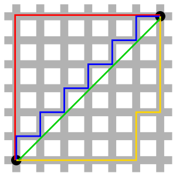

De Manhattan-afstand $$d_1$$ tussen twee punten $$A(x_1,y_1)$$ en $$B(x_2,y_2)$$ is gedefinieerd als:

$$
d_1 = |x_1-x_2| + |y_1-y_2|
$$

Deze afstandsmaat is geïnspireerd op de route die een taxi aflegt in Manhattan. Zoals je op onderstaande afbeelding kan zien is de rode, blauwe en gele route exact hetzelfde. De groene afstand, is de vertrouwde *Euclidische* afstand.

{:data-caption="De rode, blauwe en gele (taxi)routes hebben exact dezelfde afstand, de Manhattan-afstand." width="300px"}

## Opgave
Schrijf een functie `manhattan( punt1, punt2 )` die de Manhattan-afstand **retourneert** tussen de twee punten `punt1` en `punt2`. 

{: .callout.callout-info}
> #### Tip
> Gebruik de functie `abs()`.

#### Voorbeeld
De Manhattan-afstand van `(3,4)` tot `(-1,9)` is `9`.