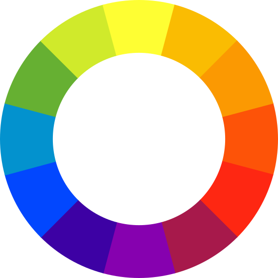

Kleuren kunnen digitaal voorgesteld worden in het RGB-kleursysteem. Hierbij gebruikt men 3 bytes om de hoeveelheid **R**ood, **G**roen en **B**lauw voor te stellen. De RGB-code (0, 128, 128) stelt bijvoorbeeld de kleur <span style="color:#008080">**groenblauw**</span> voor.

Elk van de 3 getallen in het RGB-kleursysteem kan een waarde aannemen van 0 tot en met 255. Er zijn dus telkens 256 mogelijkheden per kleurcode.

Complementaire kleuren zijn kleuren die sterk contrasteren. Het zijn de kleuren die tegenover elkaar staan in de <a href="https://nl.wikipedia.org/wiki/Kleurencirkel" target="_blanc">*kleurencirkel*</a>. Zo zijn <span style="color:#FEFE33">**geel**</span> en <span style="color:#8601AF">**paars**</span> bijvoorbeeld complementaire kleuren.

{:data-caption="De kleurencirkel." width="300px"}

## Opgave
schrijf een functie `complementair()` die gegeven een RGB-code als tupel de complementaire code afdrukt. Je kan kan de complementaire kleur berekenen via de formule:

<div class="dodona-centered-group">
(255 - <span style="color:#FF0000">rood</span>, 255 - <span style="color:#00FF00">groen</span>, 255 - <span style="color:#0000FF">blauw</span>)
</div>

#### Voorbeeld
```
>>> complementair( (0, 128, 128) )
(255, 128, 128)
```

{: .callout.callout-info}
> #### Tip
> Gebruik de modulo operator `%`.