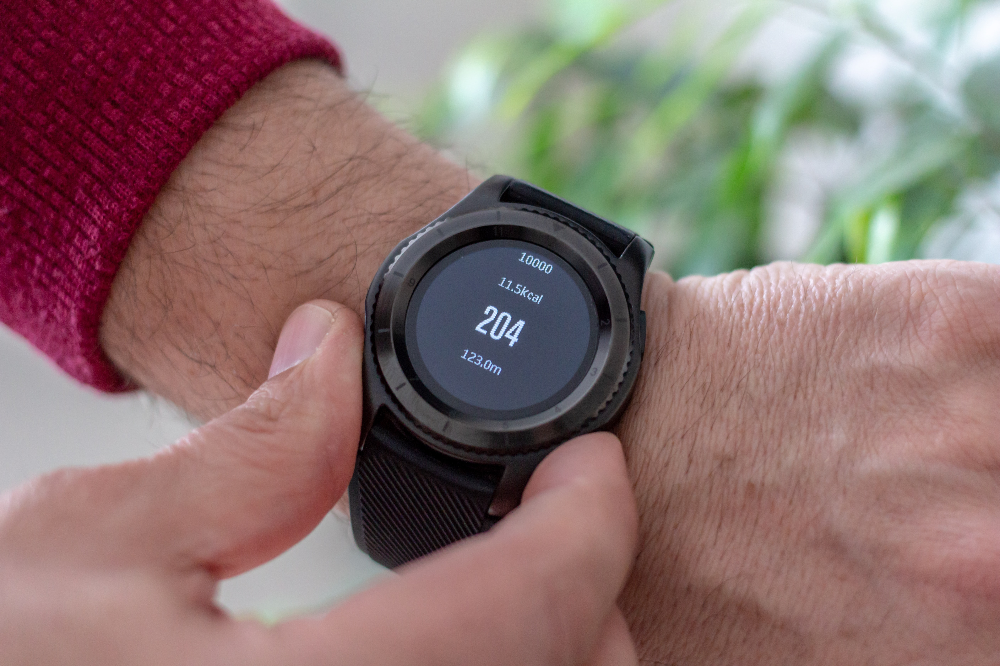

De **VO₂max** of het **maximale zuurstofopnamevermogen** is het maximale volume zuurstofgas dat het menselijk lichaam per tijdseenheid kan transporteren en metaboliseren bij lichamelijke inspanning, gemeten op zeeniveau. 

Gemiddeld gesproken hebben mannen een VO₂max tusse 35 en 40 ml/kg/min. Voor vrouwen ligt dit tussen de 27 en 31 ml/kg/min. Topsporters kunnen waarden bereiken die tussen de 60 en 95 ml/kg/min liggen.

{:data-caption="Een sporthorloge" width="40%"}

Een methode om de VO₂max te schatten die gebruikt wordt door sporthorloges is de volgende:

$$
\text{VO}_2\text{max} = 15 \cdot \dfrac{\text{HR}_{\text{max}}}{\text{HR}_\text{rust}}
$$

waarbij $$\text{HR}_{\text{max}}$$ de maximale hartslag en $$\text{HR}_{\text{rust}}$$ de hartslag in rust voorstelt.

## Opgave
Schrijf een programma dat in volgorde de maximale hartslag $$\text{HR}_{\text{max}}$$ en de hartslag in rust $$\text{HR}_{\text{rust}}$$ vraagt en vervolgens de VO₂max schatting op 1 cijfer na de komma berekent.

#### Voorbeeld
Bij achtereenvolgende invoer van 201.5 en 65.5 verschijnt er:
```
VO2max: 46.1
```

Voor de invoer 178 en 102.1 verschijnt er:
```
VO2max: 26.2
```