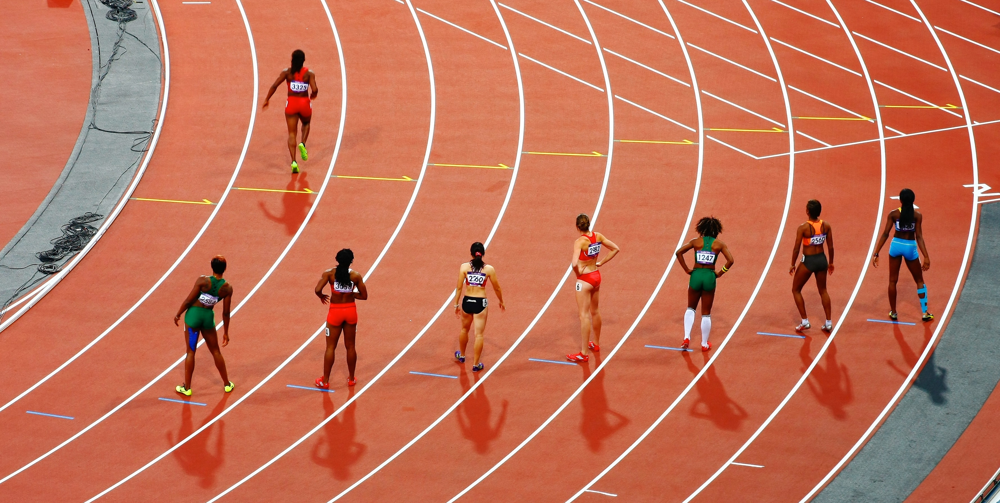

Hardlopers drukken hun **snelheid** niet uit in km per uur, maar gebruiken de grootheid **tempo**. Deze grootheid wordt meestal uitgedrukt in minuten per km.

{:data-caption="Lopers staan klaar op de looppiste" width="40%"}

Op de uurloop liep <a href='https://nl.wikipedia.org/wiki/Bashir_Abdi' target='_blank'>Bashir Abdi</a> in 2020 21,322 km wat overeenkomt met een gemiddeld tempo van 2,81 minuten per km. Bij de vrouwen is <a href='https://nl.wikipedia.org/wiki/Nina_Lauwaert' target='_blank'>Nina Lauwaert</a> de Belgische recordhoudster met 17,315 km of een gemiddeld tempo van 3,47 minuten per km.

## Opgave
Schrijf een programma dat een snelheid vraagt (in km/u) en het corresponderende tempo berekent. Afgerond op 2 cijfers na de komma.


#### Voorbeeld
De invoer 21.322 leidt tot uitvoer:
```
2.81
```

En bij invoer 17.315 verschijnt er:
```
3.47
```