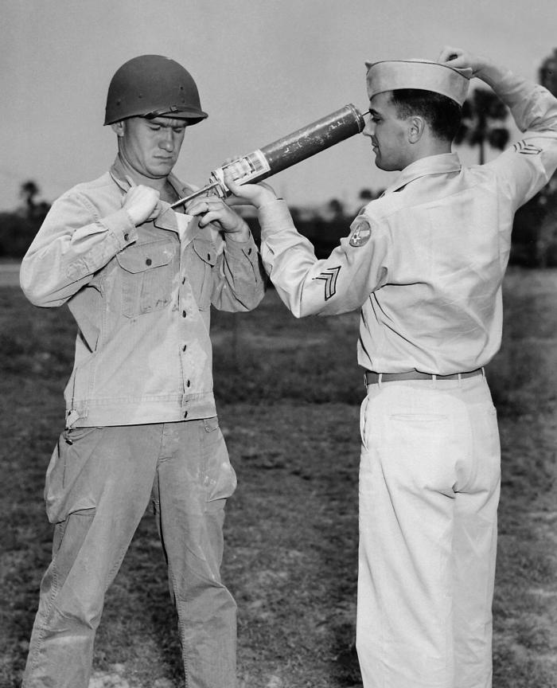

<a href="https://nl.wikipedia.org/wiki/Dichloordifenyltrichloorethaan" target="_blank">Dichloordifenyltrichloorethaan</a> of **DDT** is een organisch chemisch insecticide met als brutoformule C<sub>14</sub>H<sub>9</sub>C<sub>15</sub>. Na de tweede wereldoorlog werd deze stof op grote schaal gebruikt als insecticide, tot in 1962 werd aangetoond dat deze stof zeer schadelijk is voor het milieu. Daarnaast werd ook een sterke link gevonden met borst- en baarmoederkanker. Vandaar het gebruik van DDT sinds 1974 verboden is. 

DDT kent een zogenaamde **halveringstijd** van nagenoeg 15 jaar. Dit betekent dat elke 15 jaar er nog half zoveel van de stof overblijft. Indien men vertrekt van 100 g DDT is er na 15 jaar nog 50 g over. Na 30 jaar is er 25 g over, enz...

{:data-caption="Een soldaat uit WII krijgt een behandeling met DDT." width="40%"}

## Opgave
Schrijf een programma dat een beginhoeveelheid $$d_0$$ in gram vraagt en het aantal jaar $$n$$. Nadien berekent het programma de resterende hoeveelheid $$r$$, afgerond op 1 cijfer na de komma. Je kan hiervoor de volgende formule gebruiken:

$$
    r = d_0 \cdot 2^{\frac{-n}{15}}
$$

#### Voorbeelden
Voor 100 g en 15 jaar verschijnt er:
```
Na 15 jaar is er 50.0 g DDT over.
```

Voor 500 g en 100 jaar verschijnt er:
```
Na 100 jaar is er 4.9 g DDT over.
```

{: .callout.callout-info}
> #### Tip
> Gebruik de functie `pow()`.

{:data-caption="DDT, niet te verwarren met Dimitri De Tremmerie." width="242px"}