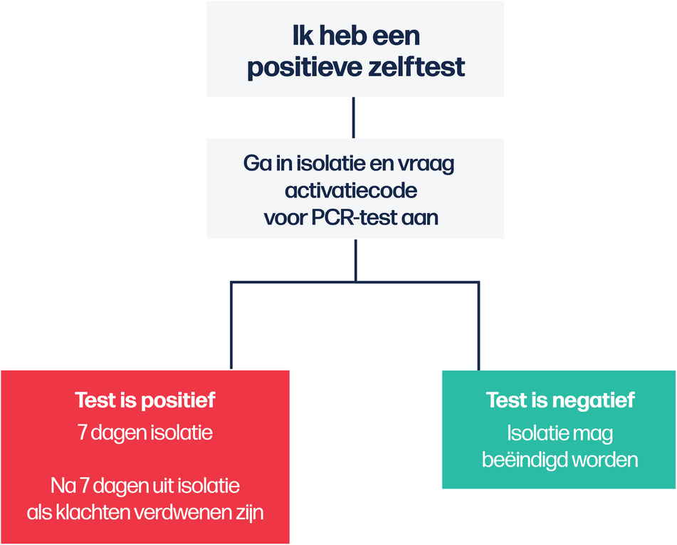
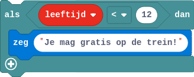
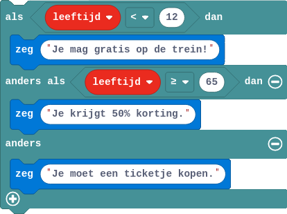

## De selectie
Elke dag maak je beslissingen. Ga je bijvoorbeeld naar buiten, dan redeneer je '*als het regent, dan doe ik een jas aan*'. We noemen dit een **selectie** of **keuze**structuur. Op 4 januari 2022 kon je op VRT.NWS het nieuwe testbeleid aflezen. Ook hier zie je een keuzestructuur visueel vorm gegeven.

{:data-caption="Corona testbeleid, VRT.NWS 04-01-2022" width="35%"}

### Eenzijdige selectie
De meest eenvoudige keuzestructuur is de eenzijdige. Kinderen jonger dan 12 jaar die met de trein reizen hoeven geen biljet te kopen. In Minecraft zouden we dit als volgt programmeren.

{:data-caption="Een eenzijdige selectie Minecraft Education Edition" width="328px"}

In Pyton wordt dit als volgt vertaald:
```python
leeftijd = float( input( 'Geef je leeftijd in: ' ) )

if leeftijd < 12:
    print( 'Je mag gratis op de trein!' )
```
Heel belangrijk is de indentatie van de code. Je merkt op dat het gedeelte onder de `if` naar rechts opgeschoven is.

### Tweezijdige selectie
Het programma wordt iets vollediger als we een tweezijdige selectie gebruiken.

{:data-caption="Een tweezijdige selectie Minecraft Education Edition" width="333px"}

In Pyton wordt dit vertaald in een `if` / `else` expressie:
```python
leeftijd = float( input( 'Geef je leeftijd in: ' ) )

if leeftijd < 12:
    print( 'Je mag gratis op de trein!' )
else: 
    print( 'Je moet een ticketje kopen.' )
```

### Meervoudige selectie
Tot slot kan je het programma gemakkelijk uitbreiden met meerdere keuzes

{:data-caption="Een meervoudige selectie Minecraft Education Edition" width="414px"}

In Pyton wordt dit vertaald in met een `elif` (afkorting van `else if`) expressie:
```python
leeftijd = float( input( 'Geef je leeftijd in: ' ) )

if leeftijd < 12:
    print( 'Je mag gratis op de trein!' )
elif leeftijd >= 65:
    print( 'Je krijgt 50% korting.' )
else: 
    print( 'Je moet een ticketje kopen.' )
```

## Opgave
Indien je 5 boeken bestelt van € 20,34 en hier € 15,3 verzendingskosten voor betaald, bereken dan de uiteindelijke kostprijs.

Vul het onderstaande programma aan. Zorg ervoor dat de kostprijs uiteindelijk weergegeven wordt. Welk datatype heeft `kostprijs`?

{: .callout.callout-info}
> #### Tip
> Gebruik de standaard bewerkingen binnen Python, `+` voor optelling, `-` voor aftrekking, `*` voor vermenigvuldiging en `/` voor deling.