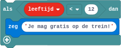
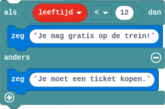

## De selectie
Elke dag maak je beslissingen. Wil je bijvoorbeeld naar buiten gaan, dan beslis je '*als het regent, dan doe ik een jas aan*'. We noemen dit een **selectie** of **keuze**structuur. Op 4 januari 2022 kon je op VRT.NWS het nieuwe testbeleid aflezen. Ook hier zie je een keuzestructuur visueel vorm gegeven.

{:data-caption="Corona testbeleid, VRT.NWS 04-01-2022" width="40%"}

### Eenzijdige selectie
De meest eenvoudige keuzestructuur is de eenzijdige. Kinderen jonger dan 12 jaar die met de trein reizen hoeven geen biljet te kopen. In Minecraft zouden we dit als volgt programmeren.

{:data-caption="Een eenzijdige selectie Minecraft Education Edition" width="238px"}

In Pyton wordt dit als volgt vertaald:
```python
leeftijd = float( input( 'Geef je leeftijd in: ' ) )

if leeftijd < 12:
    print( 'Je mag gratis op de trein!' )
```
Heel belangrijk is de **indentatie** van de code.

### Tweezijdige selectie
Het programma wordt iets vollediger als we een tweezijdige selectie gebruiken.

{:data-caption="Een tweezijdige selectie Minecraft Education Edition" width="238px"}

In Pyton wordt dit vertaald als een `if` / `else` expressie:
```python
leeftijd = float( input( 'Geef je leeftijd in: ' ) )

if leeftijd < 12:
    print( 'Je mag gratis op de trein!' )
else: 
    print( 'Je moet een ticket kopen.' )
```

### Meervoudige selectie
Tot slot kan je het programma gemakkelijk uitbreiden met meerdere keuzes.

{:data-caption="Een meervoudige selectie Minecraft Education Edition" width="300px"}

Je kan dit op twee manieren programmeren in Python, met behulp van **geneste** selecties:
```python
leeftijd = float( input( 'Geef je leeftijd in: ' ) )

if leeftijd < 12:
    print( 'Je mag gratis op de trein!' )
else:
    if leeftijd >= 65:
        print( 'Je krijgt 50% korting.' )
    else: 
        print( 'Je moet een ticket kopen.' )
```

Of efficiënter met de `elif` (afkorting van `else if`) instructie:
```python
leeftijd = float( input( 'Geef je leeftijd in: ' ) )

if leeftijd < 12:
    print( 'Je mag gratis op de trein!' )
elif leeftijd >= 65:
    print( 'Je krijgt 50% korting.' )
else: 
    print( 'Je moet een ticket kopen.' )
```

## Opgave
Schrijf een programma dat een (komma)getal aan de gebruiker vraagt via de `input()` functie. Is het getal positief dan verschijnt de tekst `positief`. In het andere geval verschijnt `strikt negatief`.