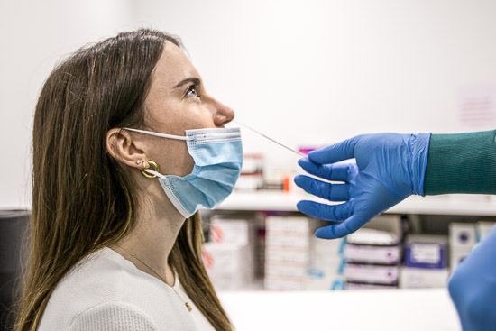

Indien er gedurende de coronapandemie een risicocontact plaatsvond werd een PCR-test uitgevoerd. Met behulp van een wisser wordt wat genetisch materiaal verzameld. De PCR techniek bestaat erin om het genetisch materiaal in verschillende cylci telkens te gaan kopiëren.

{:data-caption="Afname van een wisser." width="35%"}

Hoe minder cylci nodig zijn om de gezochte genen te kunnen detecteren hoe sterker positief het staal. Hoe meer cylci nodig zijn hoe zwakker het staal. Het aantal cycli waarop men de gezochte genen kan detecteren noemt men de **Cycle treshold** (Ct-waarde).

| Ct-waarde | beschrijving |
|:--------:|-------------|
| ≤ 13.1  |    zeer sterk positief (superverspreider) |
| > 13.1 en ≤ 19.5 |  sterk positief |
| > 19.5 en ≤ 26.0  | gewoon positief |
| > 26.0 |  zwak positief |
{:class="table table-striped table-condensed" style="width:auto;margin-left:auto;margin-right:auto;"}

## Opgave
Schrijf een functie `ct_treshold()` die als parameter een Ct-waarde neemt en als uitvoer de beschrijving afdrukt.

#### Voorbeeld
```
>>> ct_treshold( 15 )
sterk positief
>>> ct_treshold( 20.2 )
gewoon positief
```