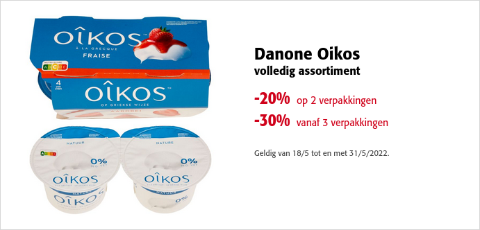

Op de website van de Colruyt vinden we onderstaande promo voor een verpakking met 4 porties aardbeienyoghurt van €3,29.

{:data-caption="Korting op de yoghurt." width="450px"}

## Opgave
Schrijf een functie `kostprijs()` met het aantal **verpakkingen** als parameter en die de totale kostprijs **afdrukt**. 
De totale kostprijs wordt afgerond op 2 cijfers na de komma.

#### Voorbeelden
Er moet gelden:
```
>>> kostprijs( 1 )
3.29
```
```
>>> kostprijs( 2 )
5.26
```
```
>>> kostprijs( 3 )
6.91
```
```
>>> kostprijs( 10 )
23.03
```
