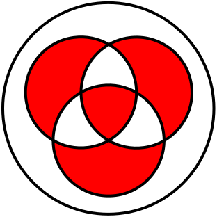

Het symmetrisch verschil van drie verzamelingen zie je op onderstaande figuur in het rood geïllustreerd.

{:data-caption="Het symmetrisch verschil van drie verzamelingen." width="250px"}

## Opgave
Schrijf een functie `symmetrisch_verschil( inA, inB, inC )` die gegeven 3 booleaanse waarden (`True` of `False`) controleert of het element tot het symmetrisch verschil van $$A$$, $$B$$ en $$C$$ behoort. De parameters `inA`, `inB` en `inC` stellen telkens voor of een bepaald element tot respectievelijk verzameling $$A$$, verzameling $$B$$ en verzameling $$C$$ behoort.

#### Voorbeelden
```
>>> symmetrisch_verschil( True, True, True )
True
```
```
>>> symmetrisch_verschil( True, False, False )
True
```
```
>>> symmetrisch_verschil( True, True, False )
False
```
