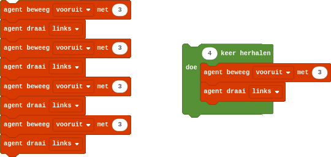

## De begrensde herhaling
Computers zijn zeer goed in het herhalen van opdrachten. In het algemeen vinden mensen het saai om eenzelfde opdracht vaak uit te voeren, maar computers kunnen eenzelfde opdracht duizenden keren uitvoeren en kunnen dit bovendien zeer **snel** en **nauwkeurig**.

In Minecraft hebben we reeds kennis gemaakt met herhalingen, *iteraties*, lussen of *loops*. Liet je de agent een vierkant van 3 op 3 afleggen, dan deed je dit efficiënter met een begrensde herhaling.

{:data-caption="Een begrensde herhaling in Minecraft Education Edition" width="540px"}

Om in Python een begrensde herhaling uit te voeren maak je gebruik van de `for`-*loop*:

```python
for i in range( 10 ):
    print( i )
```

{: .callout.callout-danger}
> #### Opgelet
> Merk op dat de variabele `i` de waarde 10 **niet** bereikt.

Je kan de herhaling ook laten starten vanaf 1:

```python
for i in range( 1, 10 ):
    print( i )
```

Of in stappen van 2 werken:

```python
for i in range( 1, 10, 2 ):
    print( i )
```

### Verkorte operatoren
Onderstaand programma vraagt vier keer om een getal in te geven en berekent telkens de som. Uiteindelijk wordt deze som weergegeven op het scherm. Het programma begint met een *initialisatie* van de variabele `som`. Daarna wordt het ingegeven `getal` telkens toevoegd aan de variabele `som`.

```python
som = 0
for i in range( 4 ):
    getal = int( input( 'Geef een geheel getal in: ' ) )
    som = som + getal
print( 'De som van de vier getallen is', som )
```

In de praktijk wordt dit steeds korter geschreven, men vervangt de regel `som = som + getal` door `som += getal`. Omdat dit zeer vaak voorkomt bij het programmeren bestaan de verkorte operatoren: `+=` maar ook `-=`, `*=` en `/=`.

### Herhalen over collecties
Je kan de `for`-loop ook toepassen op lijsten of tupels.
```python
neefjes = ( 'Kwik Duck', 'Kwek Duck', 'Kwak Duck') # tupel
print( 'De neefjes van Donald Duck zijn: ')
for neef in neefjes:
    print( neef )
```

Je kan zelfs itereren over de letters van een woord:
```python
for letter in 'Python':
    print( letter )
```

## Opgave
Bartholomew Jojo (Bart) Simpson is een personage uit de animatieserie The Simpsons. Matt Groening bedacht Bart samen met de andere Simpsons als onderdeel van een animatiefilmpje die hij moest maken. De personages waren allemaal gebaseerd op Matt zijn eigen gezinsleden.

In een interview maakte Matt bekend dat hij de naam 'Bart' koos omdat het een anagram is van brat (Engels voor 'kwajongen'). In de opening sequence van een episode zie je Bart Simpson straf schrijven op een schoolbord.

{:data-caption="Bart Simpson" width="45%"}

Schrijf een programma dat een natuurlijk getal vraagt en vervolgens evenveel keer de zin "*Ik zal meer dan twee oefeningen programmeren maken!*" op het scherm afdrukt.

#### Voorbeeld
Na invoer van 11 verschijnt:
```
Ik zal meer dan twee oefeningen programmeren maken!
Ik zal meer dan twee oefeningen programmeren maken!
Ik zal meer dan twee oefeningen programmeren maken!
Ik zal meer dan twee oefeningen programmeren maken!
Ik zal meer dan twee oefeningen programmeren maken!
Ik zal meer dan twee oefeningen programmeren maken!
Ik zal meer dan twee oefeningen programmeren maken!
Ik zal meer dan twee oefeningen programmeren maken!
Ik zal meer dan twee oefeningen programmeren maken!
Ik zal meer dan twee oefeningen programmeren maken!
Ik zal meer dan twee oefeningen programmeren maken!
```
