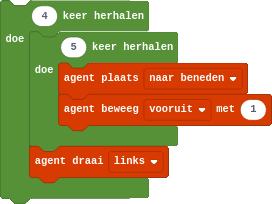

## Geneste herhalingen
Je kunt een lus in een andere lus stoppen. Hoewel dit een eenvoudig concept is, is dit vaak moeilijker om te bevatten.

Je herinnert je waarschijnlijk nog hoe we in Minecraft een vierkant konden laten bouwen:

{:data-caption="Een geneste herhaling in Minecraft Education Edition" width="272px"}

In Python programmeer je een geneste herhaling als volgt:

```python
for i in range( 4 ):
    for j in range( 5 ):
        print ( '(i,j) = (', i, ',', j, ')' )
    print( '\n' ) # dit print een lege lijn
```

## Opgave
Schrijf een programma dat alle paren (i,j) afdrukt, waarbij i en j de waardes 0 tot en met 3 kunnen aannemen, maar ze nooit dezelfde waarde mogen hebben.


#### Voorbeeld
