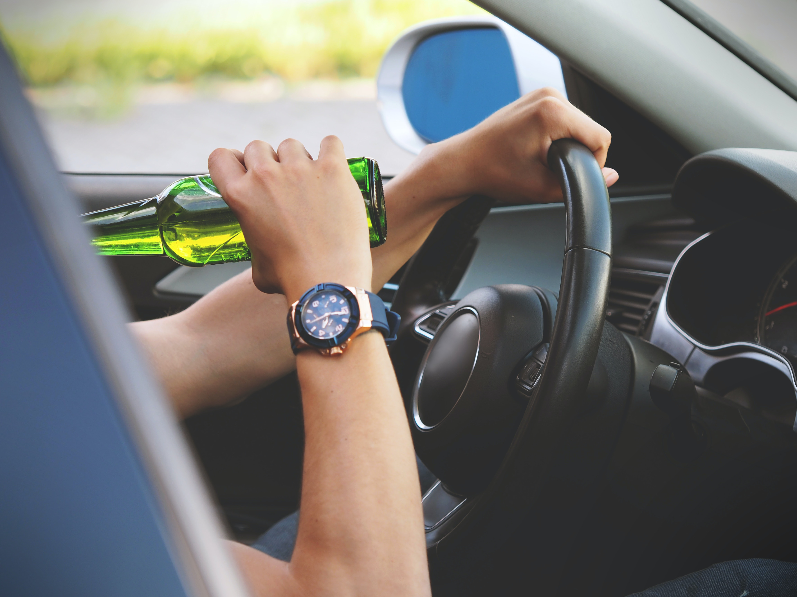

{:data-caption="Alcohol en rijden gaat niet samen." width="450px"}

Bij een ademtest voor alcoholcontrole verschijnt een letter op het testtoestel. Dit kan S, A of P zijn. Dit resultaat bepaalt of er al dan niet een ademanalysetest moet volgen. Het is het resultaat van de de ademanalysetest die zal bepalen welke exacte straf en welke boete je krijgt. 

De ademtest bepaalt volgende directe gevolgen: 

S
: Alcoholgehalte is **onder** het wettelijk toegelaten maximum van 0,5 promille, u mag verder rijden. 

A
: Vermoedelijke inbreuk. Alcoholgehalte ligt tussen 0,5 en 0,8 promille. U zult een ademanalyse moeten doen en krijgt een tijdelijk rijverbod van drie uur.

P
: Alcoholniveau ligt boven 0,8 promille. Uitslag is positief. U moet een ademanalyse doen en krijgt een rijverbod van zes uur. 

## Opgave
Schrijf een programma dat aan de gebruiker het aantal promille (kommagetal) **vraagt** en waarbij daarna het gevolg verschijnt. 

#### Voorbeeld
Voor de invoer `0.2` verschijnt:
```
S: U mag verder rijden. 
```
Voor invoer `0.6` verschijnt:
```
A: U krijgt een rijverbod van 3 uur en moet een ademanalyse doen. 
```
Voor invoer `1.2` verschijnt:
```
P: U krijgt een rijverbod van 6 uur en moet een ademanalyse doen. 
```