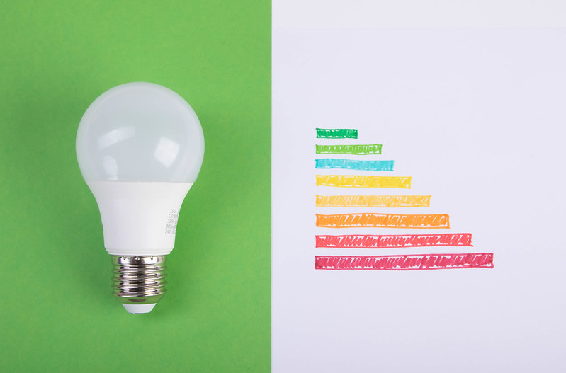

Een lamp vervangen is niet zo eenvoudig als het ooit was. Er is keuze uit zeer veel verschillende soorten, LED, halogeen, spaarlampen, enz... Bij het kiezen van een nieuwe lamp hou je best rekening met:

- De hoeveelheid licht (lichtstroom genoemd) die de lamp produceert, uitgedrukt in lumens (lm)
- Het energieverbruik over 1000 uur uitgedrukt in kW per 1000 u
- De energieklasse van de lamp, een label van A tot en met G

{:data-caption="Bespaar energie door zuinige lampen te kiezen." width="40%"}

De energieklasse van een lamp bepaalt hoe duurzaam een lamp is. Om de klasse te bepalen dient men eerst de efficiëntie uit te rekenen met onderstaande formule:

$$
    \text{efficiëntie} = \dfrac{\text{lichtstroom}}{\text{energieverbruik over 1000 u}}
$$

Nadien kan men onderstaande tabel gebruiken om het label te bepalen:

| energieklasse | efficiëntie |
|:--------:|--------|
| <span style="color:#008E11">A</span> | 210 of hoger|
| <span style="color:#00C82E">B</span> | 185 of hoger|
| <span style="color:#85FA3F">C</span> | 160 of hoger|
| <span style="color:#FFFB40">D</span> | 135 of hoger|
| <span style="color:#F3AD30">E</span> | 110 of hoger|
| <span style="color:#F56024">F</span> | 85 of hoger|
| <span style="color:#C70017">G</span> | onder 85|
{:class="table table-striped table-condensed" style="width:auto;margin-left:auto;margin-right:auto;"}

## Opgave
Schrijf een functie `energieklasse( lichtstroom, energieverbruik )` met twee parameters die de energieklasse van de lamp afdrukt.

#### Voorbeelden
Een lamp van 1600 lm die 8 kW per 1000 uur verbruikt heeft energieklasse B.
```
>>> energieklasse( 1600, 8 )
Energieklasse: B

```

Een lamp van 1800 lm die slechts 5 kW per 1000 uur verbruikt heeft energieklasse A.
```
>>> energieklasse( 1800, 5 )
Energieklasse: A
```