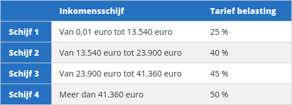

In België dient een inwoner op zijn inkomsten belastingen te betalen. Het Belgische systeem is progressief. Dat wil zeggen dat het tarief van de belasting stijgt naarmate het inkomen groter wordt. 

Op de website van de Federale overheidsdienst Financiën kan men voor aanslagjaar 2022 de volgende tarieven terugvinden.

{:data-caption="De Belgische belastingstarieven voor de inkomsten van 2021." width="500px"}

Stel dat iemand belastbaar inkomen van € 26 000 heeft. Dan wordt de belasting als volgt berekend:

- De eerste schijf van € 13 540 wordt belast aan 25%, dit levert € 3 385 op
- De volgende schijf van € 10 360 (€ 23 900 - € 13 540) wordt belast aan 40%, dit levert € 4 144 op
- Er blijft nu nog € 2 100 (€ 26 000 - € 23 900) over, wat belast wordt aan 45%, dit levert uiteindelijk nog € 945 op.

Alles samen bedraagt de belasting dus € 8 474.

## Opgave
Schrijf een functie `belasting( inkomen )` met het inkomen als parameter die de hoeveelheid belastingen berekend.

#### Voorbeelden
```
>>> belasting( 26000 ) 
8474.0
```
```
>>> belasting( 43000 ) 
16206.0
```