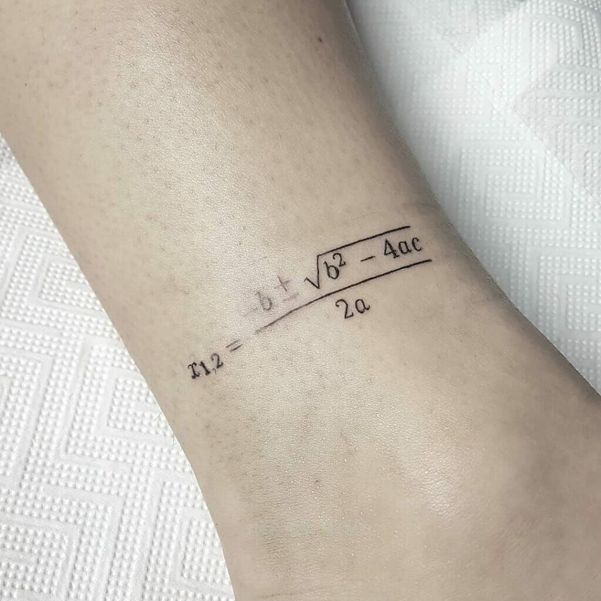

De <a href='https://nl.wikipedia.org/wiki/Wortelformule' target='_blanc'>wortelformule</a> is **de** algemene methode om een vierkantsvergelijking op te lossen. In de volgende opdracht ga je dit omzetten naar Python code.

{:data-caption="De oplossingen van een vierkantsvergelijking." width="300px"}

## Opgave

Schrijf een functie `vkv( a, b, c )` die voor een vierkantsvergelijking $$ax^2+bx+c=0$$ de oplossingen berekent. De oplossingen worden op een specifieke manier **afgedrukt**. Het resultaat wordt afgerond op 2 cijfers na de komma (indien nodig).

{: .callout.callout-info}
> #### Tip
> Om de vierkantswortel te berekenen gebruik je `math.sqrt()`. Er geldt bijvoorbeeld dat `math.sqrt( 36 )` gelijk is aan `6.0`.

#### Voorbeelden
De vierkantsvergelijking $$x^2+3x-4 = 0$$ heeft als oplossingenverzameling $$V = \{-4, 1\}$$.
```
>>> vkv( 1, 3, -4 ) 
Er zijn 2 reële oplossingen, namelijk 1.0 en -4.0
```

De vierkantsvergelijking $$x^2+2x+1 = 0$$ heeft als oplossingenverzameling $$V = \{-1\}$$.
```
>>> vkv( 1, 2, 1 ) 
Er is één oplossing, namelijk: -1.0
```

De vierkantsvergelijking $$2x^2+6x+5 = 0$$ heeft geen reële oplossingen.
```
>>> vkv( 2, 6, 5 ) 
Er zijn geen reële oplossingen
```