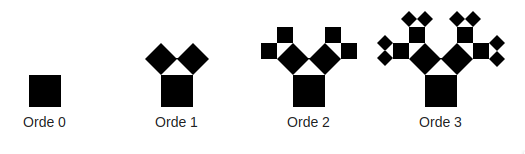

> O Pythagorasboom, o Pythagorasboom, wat zijn uw takken wonderschoon.

De boom van Pythagoras is een fractaal bedacht door Albert E. Bosman in 1942. De bouw van deze boom begint met een vierkant. Op dit vierkant worden onder een hoek van 45 graden vervolgens twee kleinere vierkanten gezet zodat de ingesloten driehoek **gelijkbenig en rechthoekig** is. Dezelfde procedure wordt vervolgens ad infinitum ("tot in het oneindige") toegepast op steeds weer nieuwe vierkanten. De afbeelding hieronder toont de eerste vier iteraties in dit constructieproces voor de boom van Pythagoras. 

{:data-caption="De opbouw van een Pythoras boom." width="525px"}

Vanaf orde 5 overlappen delen van de boom elkaar.

## Opgave
Schrijf een functie `oppervlakte_boom( orde )` met de orde als parameter, die de oppervlakte van de boom van Pythagoras berekent. Je hoeft geen rekening te houden met het feit dat bepaalde delen elkaar kunnen overlappen. Rond de oppervlakte af op 9 cijfers na de komma. Neem 1 als zijde van het eerste vierkant.

#### Voorbeelden
```
>>> oppervlakte_boom( 1 )
2.0
```
```
>>> oppervlakte_boom( 2 )
3.414213562
```

{: .callout.callout-info}
> #### Tip
> Probeer de berekening eerst op papier uit te voeren voor een vierkant met zijde a.