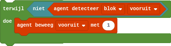

## De voorwaardelijke herhaling
Soms wil je instructies herhalen, maar weet je op voorhand niet hoe vaak. In dit geval kan een voorwaardelijke herhaling een oplossing vormen.

In Minecraft konden we de agent vooruit laten bewegen **zolang** er voor zich geen blok werd gedetecteerd, dit deden we als volgt.

{:data-caption="Een voorwaardelijke herhaling in Minecraft Education Edition" width="354px"}

Deze soort herhaling kan ook uitgevoerd worden in Python. Beschouw eerst het volgende voorbeeld uit Minecraft:

{:data-caption="Een voorwaardelijke herhaling in Minecraft Education Edition" width="298px"}

In Python wordt dit gecodeerd met een `while`-loop:
```python
getal = 1
while getal <= 5:
    print( getal )
    getal += 1
```

Dit zouden we natuurlijk ook kunnen programmeren met behulp van een `for`-loop:
```python
for getal in range( 1, 6 ):
    print( getal )
```

Toch zal je niet elke `while`-loop kunnen schrijven met behulp van een `for`-loop, omgekeerd kan dit wel.

Je kan een voorwaardelijke herhaling bijvoorbeeld gebruiken om getallen te laten invoeren, tot een `0` ingegeven wordt. Beschouw bijvoorbeeld het onderstaande programma dat van een rij getallen het minimum, maximum en het aantal getallen deelbaar door 3 vraagt:
```python
import math

# initialisatie
min = math.inf
max = -math.inf
aantal = 0

getal = int( input( 'Geef een getal in (tik 0 in om te stoppen): ' ))
while getal != 0:
    if getal < min:
        min = getal
    if getal > max:
        max = getal
    aantal += int( getal % 3 == 0 )
    getal = int( input( 'Geef een getal in (tik 0 in om te stoppen): ' ))

print( 'Grootste getal:', max )
print( 'Kleinste getal:', min )
print( 'Aantal getallen deelbaar door 3:', aantal )
```

#### Oneindige lussen
Omdat een voorwaardelijke herhaling niet op voorhand vastlegt hoe vaak de instructies herhaald zullen worden kan je soms in een oneindige herhaling verzeild geraken. De volgende code is een voorbeeld van zo'n oneindige lus. Gebruik <kbd>Ctrl</kbd>+<kbd>c</kbd> om de uitvoering van de code te beëindigen.

```python
nummer = 1
totaal = 0
while ( nummer * nummer ) % 1000 != 0:
    totaal += nummer
print ( 'Totaal is', totaal )
```

## Opgave
Je hebt in een vorige oefening al een functie `tafel()` geschreven, die de tafel van vermenigvuldiging afdrukt voor een gegeven getal.

Schrijf nu opnieuw zo'n functie, maar maak gebruik van een `while`-lus.

#### Voorbeeld
```
>>> tafel( 12 )
1 * 12 = 12
2 * 12 = 24
3 * 12 = 36
4 * 12 = 48
5 * 12 = 60
6 * 12 = 72
7 * 12 = 84
8 * 12 = 96
9 * 12 = 108
10 * 12 = 120
```